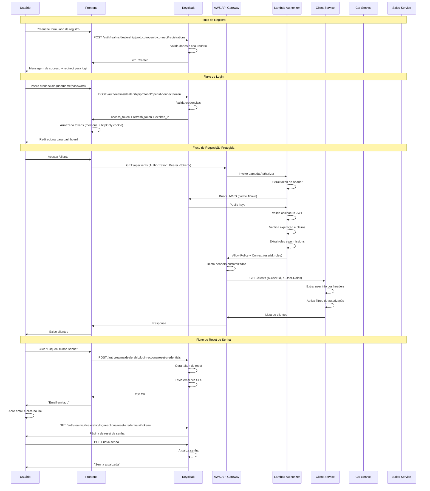
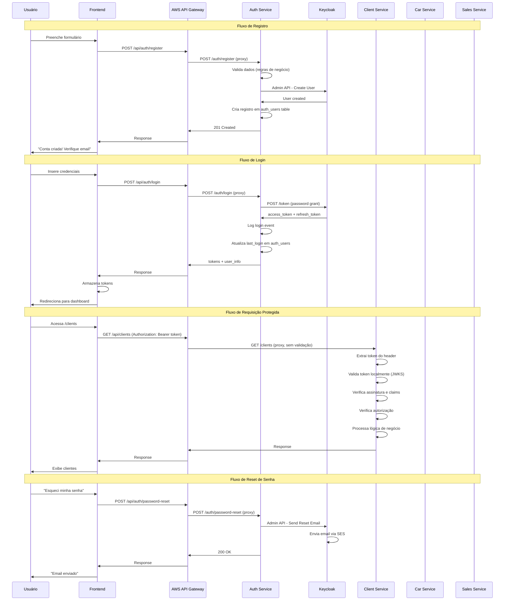
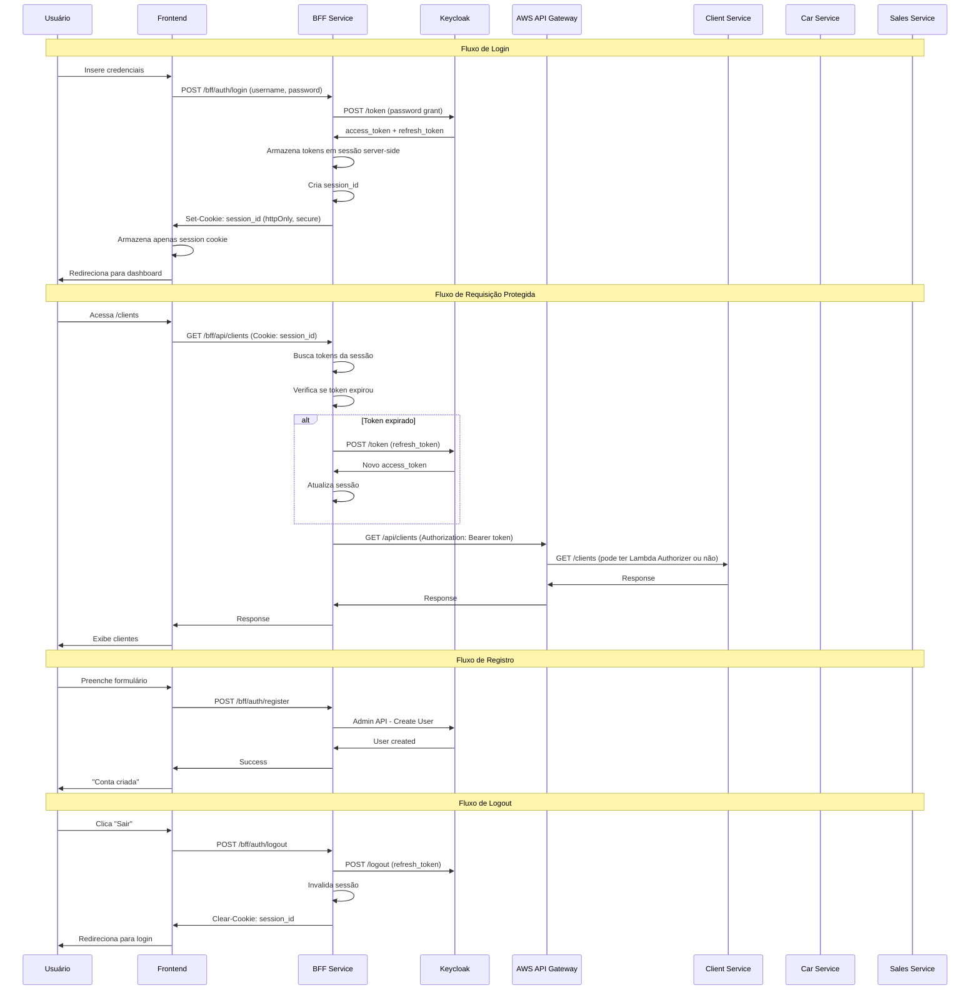

# Arquiteturas de Autenticação e Autorização com Keycloak
## Projeto Dealership - Análise Completa

---

## 📋 Índice

1. [Contexto do Projeto](#contexto-do-projeto)
2. [Arquitetura 1: Gateway Security with Lambda Authorizer](#arquitetura-1-gateway-security-with-lambda-authorizer)
3. [Arquitetura 2: Decentralized Token Validation](#arquitetura-2-decentralized-token-validation)
4. [Arquitetura 3: Backend for Frontend (BFF) Pattern](#arquitetura-3-backend-for-frontend-bff-pattern)
5. [Tabela Comparativa](#tabela-comparativa)
6. [Recomendação Final](#recomendação-final)

---

## Contexto do Projeto

### Stack Atual
- **Backend**: Java 21 + Spring Boot (microserviços)
- **Serviços**: Client Service, Car Service, Sales Service
- **Infraestrutura**: AWS (LocalStack para dev)
- **Gateway**: AWS API Gateway
- **Banco de Dados**: PostgreSQL (RDS)
- **Mensageria**: SNS, SQS
- **Arquitetura**: Event-driven, Monorepo

### Requisitos
- ✅ Autenticação com Keycloak
- ✅ Endpoints públicos (sem autenticação)
- ✅ Endpoints privados (requerem token JWT)
- ✅ Frontend com tela de login
- ✅ Suporte a múltiplos roles/permissões

---

## Arquitetura 1: Gateway Security with Lambda Authorizer

### 1. Nome e Descrição

**Nome**: **API Gateway as Security Gateway with Direct Keycloak Integration**

**Descrição**: 
O AWS API Gateway atua como ponto centralizado de segurança usando Lambda Authorizer para validar tokens JWT. O **frontend chama diretamente o Keycloak** para operações de autenticação (login, registro, reset de senha), enquanto o gateway protege todos os endpoints de negócio. Não há Auth Service intermediário.

**Casos de uso ideais**:
- Projetos que querem simplicidade e menos serviços para gerenciar
- Quando o Keycloak já oferece todas as funcionalidades de autenticação necessárias
- Sistemas onde o frontend pode confiar diretamente no Keycloak
- Arquiteturas que priorizam redução de latência (uma chamada a menos)

---

### 2. Diagrama de Fluxo



---

### 3. Componentes e Responsabilidades

#### 3.1 Frontend

**Armazenamento de Token**:
```javascript
// Estratégia segura
const tokenStorage = {
  // Access token em memória (não persiste em refresh)
  accessToken: null,
  
  // Refresh token em httpOnly cookie (backend seta)
  // document.cookie não consegue acessar
  
  // User info decodificado do JWT
  userInfo: null
};
```

**Rotas de Autenticação - Chamadas DIRETAS ao Keycloak**:

```javascript
// src/services/authService.js
import axios from 'axios';

const KEYCLOAK_URL = process.env.REACT_APP_KEYCLOAK_URL;
const REALM = 'dealership';
const CLIENT_ID = 'dealership-frontend';

export const authService = {
  // 1. LOGIN
  login: async (username, password) => {
    const response = await axios.post(
      `${KEYCLOAK_URL}/auth/realms/${REALM}/protocol/openid-connect/token`,
      new URLSearchParams({
        grant_type: 'password',
        client_id: CLIENT_ID,
        username,
        password,
      }),
      {
        headers: { 'Content-Type': 'application/x-www-form-urlencoded' }
      }
    );
    return response.data; // { access_token, refresh_token, expires_in }
  },

  // 2. REGISTRO
  register: async (userData) => {
    // Opção 1: Keycloak User Registration (requer configuração)
    const response = await axios.post(
      `${KEYCLOAK_URL}/auth/realms/${REALM}/protocol/openid-connect/registrations`,
      userData
    );
    return response.data;
    
    // Opção 2: Admin API (requer service account)
    // Não recomendado para frontend
  },

  // 3. LOGOUT
  logout: async (refreshToken) => {
    await axios.post(
      `${KEYCLOAK_URL}/auth/realms/${REALM}/protocol/openid-connect/logout`,
      new URLSearchParams({
        client_id: CLIENT_ID,
        refresh_token: refreshToken,
      }),
      {
        headers: { 'Content-Type': 'application/x-www-form-urlencoded' }
      }
    );
  },

  // 4. REFRESH TOKEN
  refreshToken: async (refreshToken) => {
    const response = await axios.post(
      `${KEYCLOAK_URL}/auth/realms/${REALM}/protocol/openid-connect/token`,
      new URLSearchParams({
        grant_type: 'refresh_token',
        client_id: CLIENT_ID,
        refresh_token: refreshToken,
      }),
      {
        headers: { 'Content-Type': 'application/x-www-form-urlencoded' }
      }
    );
    return response.data;
  },

  // 5. RESET DE SENHA (enviar email)
  requestPasswordReset: async (email) => {
    // Keycloak não tem endpoint público para isso
    // Precisa chamar API Gateway que chama Admin API
    const response = await axios.post(
      `${process.env.REACT_APP_API_URL}/api/auth/password-reset`,
      { email }
    );
    return response.data;
  },

  // 6. CONFIRMAR RESET DE SENHA
  // Usuário é redirecionado para página do Keycloak via email
  // Não é tratado pelo frontend

  // 7. VERIFICAR EMAIL (após registro)
  // Keycloak envia email automaticamente se configurado
  // Não requer ação do frontend
};
```

**Envio de Token em Requisições de Negócio**:
```javascript
// src/services/api.js
import axios from 'axios';
import { authService } from './authService';

const api = axios.create({
  baseURL: process.env.REACT_APP_API_GATEWAY_URL,
});

// Request interceptor
api.interceptors.request.use(
  (config) => {
    const token = localStorage.getItem('access_token');
    if (token) {
      config.headers.Authorization = `Bearer ${token}`;
    }
    return config;
  },
  (error) => Promise.reject(error)
);

// Response interceptor - Auto refresh
api.interceptors.response.use(
  (response) => response,
  async (error) => {
    const originalRequest = error.config;

    if (error.response?.status === 401 && !originalRequest._retry) {
      originalRequest._retry = true;

      try {
        const refreshToken = localStorage.getItem('refresh_token');
        const data = await authService.refreshToken(refreshToken);
        
        localStorage.setItem('access_token', data.access_token);
        localStorage.setItem('refresh_token', data.refresh_token);
        
        originalRequest.headers.Authorization = `Bearer ${data.access_token}`;
        return api(originalRequest);
      } catch (refreshError) {
        // Refresh falhou - logout
        localStorage.clear();
        window.location.href = '/login';
        return Promise.reject(refreshError);
      }
    }

    return Promise.reject(error);
  }
);

export default api;
```

**Bibliotecas Sugeridas**:
```json
{
  "dependencies": {
    "react": "^18.2.0",
    "react-router-dom": "^6.20.0",
    "axios": "^1.6.0",
    "jwt-decode": "^4.0.0",
    "react-hook-form": "^7.48.0"
  }
}
```

**IMPORTANTE**: 
- ❌ **NÃO** usar `keycloak-js` adapter (adiciona complexidade desnecessária)
- ✅ Fazer requisições HTTP diretas aos endpoints do Keycloak
- ✅ Gerenciar tokens manualmente (mais controle e simplicidade)

---

#### 3.2 AWS API Gateway

**Responsabilidades**:
- ✅ Validar token JWT via Lambda Authorizer (endpoints privados)
- ✅ Rotear requisições para serviços backend
- ✅ Injetar headers customizados (X-User-Id, X-User-Roles)
- ✅ Rate limiting
- ✅ CORS handling
- ✅ Request/Response logging
- ❌ NÃO gerencia autenticação (isso é com Keycloak)

**Rotas e Configuração**:

```yaml
# Terraform - API Gateway Configuration
resource "aws_api_gateway_rest_api" "dealership" {
  name        = "dealership-api"
  description = "Dealership API Gateway"
  
  endpoint_configuration {
    types = ["REGIONAL"]
  }
}

# Lambda Authorizer
resource "aws_api_gateway_authorizer" "jwt_authorizer" {
  name                   = "jwt-authorizer"
  rest_api_id            = aws_api_gateway_rest_api.dealership.id
  authorizer_uri         = aws_lambda_function.jwt_authorizer.invoke_arn
  authorizer_credentials = aws_iam_role.api_gateway_authorizer.arn
  type                   = "TOKEN"
  identity_source        = "method.request.header.Authorization"
  authorizer_result_ttl_in_seconds = 300 # Cache por 5 minutos
}

# ROTAS PÚBLICAS (sem authorizer)
# 1. Health checks
resource "aws_api_gateway_resource" "health" {
  rest_api_id = aws_api_gateway_rest_api.dealership.id
  parent_id   = aws_api_gateway_rest_api.dealership.root_resource_id
  path_part   = "health"
}

resource "aws_api_gateway_method" "health_get" {
  rest_api_id   = aws_api_gateway_rest_api.dealership.id
  resource_id   = aws_api_gateway_resource.health.id
  http_method   = "GET"
  authorization = "NONE" # Público
}

# 2. Password Reset (único endpoint de auth que passa pelo gateway)
resource "aws_api_gateway_resource" "auth" {
  rest_api_id = aws_api_gateway_rest_api.dealership.id
  parent_id   = aws_api_gateway_rest_api.dealership.root_resource_id
  path_part   = "auth"
}

resource "aws_api_gateway_resource" "password_reset" {
  rest_api_id = aws_api_gateway_rest_api.dealership.id
  parent_id   = aws_api_gateway_resource.auth.id
  path_part   = "password-reset"
}

resource "aws_api_gateway_method" "password_reset_post" {
  rest_api_id   = aws_api_gateway_rest_api.dealership.id
  resource_id   = aws_api_gateway_resource.password_reset.id
  http_method   = "POST"
  authorization = "NONE" # Público
}

# ROTAS PRIVADAS (com authorizer)
# 3. Clients API
resource "aws_api_gateway_resource" "clients" {
  rest_api_id = aws_api_gateway_rest_api.dealership.id
  parent_id   = aws_api_gateway_rest_api.dealership.root_resource_id
  path_part   = "clients"
}

resource "aws_api_gateway_method" "clients_get" {
  rest_api_id   = aws_api_gateway_rest_api.dealership.id
  resource_id   = aws_api_gateway_resource.clients.id
  http_method   = "GET"
  authorization = "CUSTOM"
  authorizer_id = aws_api_gateway_authorizer.jwt_authorizer.id
}

# Mapping template para injetar headers
resource "aws_api_gateway_integration" "clients_integration" {
  rest_api_id             = aws_api_gateway_rest_api.dealership.id
  resource_id             = aws_api_gateway_resource.clients.id
  http_method             = aws_api_gateway_method.clients_get.http_method
  integration_http_method = "GET"
  type                    = "HTTP_PROXY"
  uri                     = "http://${aws_lb.client_service.dns_name}/clients"
  
  request_parameters = {
    "integration.request.header.X-User-Id"          = "context.authorizer.userId"
    "integration.request.header.X-User-Username"    = "context.authorizer.username"
    "integration.request.header.X-User-Roles"       = "context.authorizer.roles"
    "integration.request.header.X-User-Permissions" = "context.authorizer.permissions"
    "integration.request.header.X-Request-Id"       = "context.requestId"
  }
}

# Repetir padrão para Cars e Sales APIs...
```

**CORS Configuration**:
```hcl
resource "aws_api_gateway_method" "clients_options" {
  rest_api_id   = aws_api_gateway_rest_api.dealership.id
  resource_id   = aws_api_gateway_resource.clients.id
  http_method   = "OPTIONS"
  authorization = "NONE"
}

resource "aws_api_gateway_integration" "clients_options" {
  rest_api_id = aws_api_gateway_rest_api.dealership.id
  resource_id = aws_api_gateway_resource.clients.id
  http_method = aws_api_gateway_method.clients_options.http_method
  type        = "MOCK"
  
  request_templates = {
    "application/json" = "{\"statusCode\": 200}"
  }
}

resource "aws_api_gateway_method_response" "clients_options_200" {
  rest_api_id = aws_api_gateway_rest_api.dealership.id
  resource_id = aws_api_gateway_resource.clients.id
  http_method = aws_api_gateway_method.clients_options.http_method
  status_code = "200"
  
  response_parameters = {
    "method.response.header.Access-Control-Allow-Headers" = true
    "method.response.header.Access-Control-Allow-Methods" = true
    "method.response.header.Access-Control-Allow-Origin"  = true
  }
}

resource "aws_api_gateway_integration_response" "clients_options_200" {
  rest_api_id = aws_api_gateway_rest_api.dealership.id
  resource_id = aws_api_gateway_resource.clients.id
  http_method = aws_api_gateway_method.clients_options.http_method
  status_code = aws_api_gateway_method_response.clients_options_200.status_code
  
  response_parameters = {
    "method.response.header.Access-Control-Allow-Headers" = "'Authorization,Content-Type,X-Amz-Date,X-Api-Key,X-Amz-Security-Token'"
    "method.response.header.Access-Control-Allow-Methods" = "'GET,POST,PUT,DELETE,OPTIONS'"
    "method.response.header.Access-Control-Allow-Origin"  = "'*'"
  }
}
```

**Rotas Mapeadas**:

| Método | Endpoint | Tipo | Authorizer | Target Service | Descrição |
|--------|----------|------|------------|----------------|-----------|
| GET | /health | Público | NONE | Todos | Health check |
| POST | /api/auth/password-reset | Público | NONE | Lambda Function | Reset de senha |
| GET | /api/clients | Privado | JWT | Client Service | Listar clientes |
| POST | /api/clients | Privado | JWT | Client Service | Criar cliente |
| GET | /api/clients/{id} | Privado | JWT | Client Service | Detalhes do cliente |
| PUT | /api/clients/{id} | Privado | JWT | Client Service | Atualizar cliente |
| DELETE | /api/clients/{id} | Privado | JWT | Client Service | Deletar cliente |
| GET | /api/cars | Privado | JWT | Car Service | Listar carros |
| POST | /api/cars | Privado | JWT | Car Service | Criar carro |
| GET | /api/sales | Privado | JWT | Sales Service | Listar vendas |
| POST | /api/sales | Privado | JWT | Sales Service | Criar venda |

---

#### 3.3 Lambda Authorizer

**Responsabilidades**:
- ✅ Validar token JWT
- ✅ Verificar assinatura com JWKS do Keycloak
- ✅ Verificar expiração, issuer, audience
- ✅ Extrair claims (userId, roles, permissions)
- ✅ Gerar IAM Policy (Allow/Deny)
- ✅ Cachear resultado por 5 minutos

**Implementação**:

```javascript
// lambda-authorizer/index.js
const jwt = require('jsonwebtoken');
const jwksClient = require('jwks-rsa');

const KEYCLOAK_URL = process.env.KEYCLOAK_URL;
const REALM = process.env.KEYCLOAK_REALM;
const JWKS_URI = `${KEYCLOAK_URL}/auth/realms/${REALM}/protocol/openid-connect/certs`;

// Cliente JWKS com cache
const client = jwksClient({
  cache: true,
  cacheMaxAge: 600000, // 10 minutos
  rateLimit: true,
  jwksRequestsPerMinute: 10,
  jwksUri: JWKS_URI,
});

// Busca chave pública por kid
function getKey(header, callback) {
  client.getSigningKey(header.kid, (err, key) => {
    if (err) {
      console.error('Error getting signing key:', err);
      callback(err);
      return;
    }
    const signingKey = key.publicKey || key.rsaPublicKey;
    callback(null, signingKey);
  });
}

// Valida token JWT
async function verifyToken(token) {
  return new Promise((resolve, reject) => {
    jwt.verify(
      token,
      getKey,
      {
        issuer: `${KEYCLOAK_URL}/auth/realms/${REALM}`,
        algorithms: ['RS256'],
      },
      (err, decoded) => {
        if (err) {
          console.error('JWT verification failed:', err.message);
          reject(err);
        } else {
          resolve(decoded);
        }
      }
    );
  });
}

// Gera IAM Policy
function generatePolicy(principalId, effect, resource, context = {}) {
  const policyDocument = {
    Version: '2012-10-17',
    Statement: [
      {
        Action: 'execute-api:Invoke',
        Effect: effect,
        Resource: resource,
      },
    ],
  };

  return {
    principalId,
    policyDocument,
    context, // Será convertido em headers
  };
}

// Handler principal
exports.handler = async (event) => {
  console.log('Lambda Authorizer invoked:', {
    methodArn: event.methodArn,
    authorizationToken: event.authorizationToken ? 'present' : 'missing',
  });

  const token = event.authorizationToken?.replace('Bearer ', '');

  if (!token) {
    console.error('No token provided');
    throw new Error('Unauthorized');
  }

  try {
    // Valida token
    const decoded = await verifyToken(token);
    console.log('Token validated successfully for user:', decoded.sub);

    // Extrai informações do token
    const userId = decoded.sub;
    const username = decoded.preferred_username || decoded.email;
    const email = decoded.email;
    const roles = decoded.realm_access?.roles || [];
    const permissions = decoded.permissions || [];

    // Verificações específicas por rota (opcional)
    const method = event.methodArn;
    
    // Exemplo: apenas admins podem acessar /api/admin/*
    if (method.includes('/api/admin/') && !roles.includes('admin')) {
      console.warn(`User ${userId} denied access to admin endpoint`);
      return generatePolicy(userId, 'Deny', event.methodArn);
    }

    // Gera policy de permissão com contexto
    // IMPORTANTE: Valores do context devem ser strings
    const policy = generatePolicy(userId, 'Allow', event.methodArn, {
      userId: userId,
      username: username,
      email: email,
      roles: roles.join(','),
      permissions: permissions.join(','),
    });

    console.log('Policy generated:', {
      principalId: policy.principalId,
      effect: policy.policyDocument.Statement[0].Effect,
    });

    return policy;
  } catch (error) {
    console.error('Authorization failed:', error.message);
    throw new Error('Unauthorized');
  }
};
```

**Deployment com Terraform**:

```hcl
# lambda-authorizer/main.tf
resource "aws_lambda_function" "jwt_authorizer" {
  filename         = "lambda-authorizer.zip"
  function_name    = "dealership-jwt-authorizer"
  role            = aws_iam_role.lambda_authorizer.arn
  handler         = "index.handler"
  runtime         = "nodejs18.x"
  timeout         = 10
  memory_size     = 256

  environment {
    variables = {
      KEYCLOAK_URL   = var.keycloak_url
      KEYCLOAK_REALM = "dealership"
    }
  }

  tags = {
    Name        = "JWT Authorizer"
    Environment = var.environment
  }
}

# IAM Role
resource "aws_iam_role" "lambda_authorizer" {
  name = "lambda-jwt-authorizer-role"

  assume_role_policy = jsonencode({
    Version = "2012-10-17"
    Statement = [
      {
        Action = "sts:AssumeRole"
        Effect = "Allow"
        Principal = {
          Service = "lambda.amazonaws.com"
        }
      }
    ]
  })
}

# CloudWatch Logs permission
resource "aws_iam_role_policy_attachment" "lambda_logs" {
  role       = aws_iam_role.lambda_authorizer.name
  policy_arn = "arn:aws:iam::aws:policy/service-role/AWSLambdaBasicExecutionRole"
}

# API Gateway permission to invoke Lambda
resource "aws_lambda_permission" "api_gateway" {
  statement_id  = "AllowAPIGatewayInvoke"
  action        = "lambda:InvokeFunction"
  function_name = aws_lambda_function.jwt_authorizer.function_name
  principal     = "apigateway.amazonaws.com"
  source_arn    = "${aws_api_gateway_rest_api.dealership.execution_arn}/*/*"
}
```

---

#### 3.4 Keycloak

**Configurações Necessárias**:

**Realm**: `dealership`

**Clients**:

```yaml
# Client para Frontend (público)
dealership-frontend:
  client_id: dealership-frontend
  client_protocol: openid-connect
  access_type: public
  standard_flow_enabled: true
  direct_access_grants_enabled: true # Para password grant
  valid_redirect_uris:
    - "http://localhost:3000/*"
    - "https://dealership.com/*"
  web_origins:
    - "http://localhost:3000"
    - "https://dealership.com"
  
  # Configurações de token
  access_token_lifespan: 300 # 5 minutos
  client_session_idle: 1800 # 30 minutos
  client_session_max: 36000 # 10 horas

# Client para Backend Services (confidencial)
dealership-backend:
  client_id: dealership-backend
  client_protocol: openid-connect
  access_type: confidential
  service_accounts_enabled: true
  client_secret: <generated-secret>
```

**Roles e Permissões**:

```yaml
roles:
  # Realm Roles
  - name: admin
    description: Administrador do sistema
    composite: false
    
  - name: sales_manager
    description: Gerente de vendas
    composite: false
    
  - name: sales_rep
    description: Representante de vendas
    composite: false
    
  - name: customer
    description: Cliente do sistema
    composite: false

# Client Roles (opcional, para granularidade)
client_roles:
  dealership-frontend:
    - name: read:clients
      description: Ler dados de clientes
    - name: write:clients
      description: Criar/editar clientes
    - name: read:cars
      description: Ler dados de carros
    - name: write:cars
      description: Criar/editar carros
    - name: read:sales
      description: Ler dados de vendas
    - name: write:sales
      description: Criar vendas
```

**Token Configuration**:

```yaml
# Realm Settings > Tokens
access_token_lifespan: 5m
access_token_lifespan_for_implicit_flow: 15m
client_login_timeout: 5m
refresh_token_max_reuse: 0 # Refresh token rotation
sso_session_idle_timeout: 30m
sso_session_max_lifespan: 10h
offline_session_idle_timeout: 30d
```

**User Registration**:

```yaml
# Realm Settings > Login
user_registration: true # Habilita self-registration
email_as_username: false
login_with_email_allowed: true
duplicate_emails_allowed: false
verify_email: true # Envia email de verificação
reset_password_allowed: true
remember_me: true
```

**Email Configuration (para reset de senha)**:

```yaml
# Realm Settings > Email
from: noreply@dealership.com
from_display_name: Dealership System
host: email-smtp.us-east-1.amazonaws.com
port: 587
ssl: false
starttls: true
auth: true
user: <SMTP_USERNAME>
password: <SMTP_PASSWORD>
```

**Terraform Configuration**:

```hcl
# terraform/keycloak.tf
resource "keycloak_realm" "dealership" {
  realm   = "dealership"
  enabled = true
  
  display_name = "Dealership System"
  
  # Token settings
  access_token_lifespan               = "5m"
  sso_session_idle_timeout            = "30m"
  sso_session_max_lifespan           = "10h"
  refresh_token_max_reuse            = 0
  
  # Login settings
  registration_allowed               = true
  login_with_email_allowed          = true
  duplicate_emails_allowed          = false
  verify_email                       = true
  reset_password_allowed             = true
  remember_me                        = true
  
  # Security
  password_policy                    = "length(8) and digits(1) and upperCase(1) and specialChars(1)"
}

resource "keycloak_openid_client" "frontend" {
  realm_id    = keycloak_realm.dealership.id
  client_id   = "dealership-frontend"
  name        = "Dealership Frontend"
  enabled     = true
  
  access_type                      = "PUBLIC"
  standard_flow_enabled            = true
  direct_access_grants_enabled     = true
  
  valid_redirect_uris = [
    "http://localhost:3000/*",
    "https://dealership.com/*"
  ]
  
  web_origins = [
    "http://localhost:3000",
    "https://dealership.com"
  ]
}

resource "keycloak_role" "admin" {
  realm_id    = keycloak_realm.dealership.id
  name        = "admin"
  description = "Administrator role"
}

resource "keycloak_role" "sales_rep" {
  realm_id    = keycloak_realm.dealership.id
  name        = "sales_rep"
  description = "Sales representative role"
}

resource "keycloak_role" "customer" {
  realm_id    = keycloak_realm.dealership.id
  name        = "customer"
  description = "Customer role"
}
```

---

#### 3.5 Serviços Backend (Client/Car/Sales)

**NÃO validam token** - confiam no API Gateway

**Extraem informações de headers injetados**:

```java
// SecurityConfig.java
@Configuration
@EnableWebSecurity
public class SecurityConfig {

    @Bean
    public SecurityFilterChain filterChain(HttpSecurity http) throws Exception {
        http
            .csrf().disable() // API Gateway já protege
            .authorizeHttpRequests(authz -> authz
                .requestMatchers("/health", "/actuator/**").permitAll()
                .anyRequest().authenticated()
            )
            .addFilterBefore(
                new HeaderBasedAuthenticationFilter(), 
                UsernamePasswordAuthenticationFilter.class
            );
        
        return http.build();
    }
}

// HeaderBasedAuthenticationFilter.java
@Slf4j
public class HeaderBasedAuthenticationFilter extends OncePerRequestFilter {
    
    @Override
    protected void doFilterInternal(
            HttpServletRequest request,
            HttpServletResponse response,
            FilterChain filterChain) throws ServletException, IOException {
        
        String userId = request.getHeader("X-User-Id");
        String username = request.getHeader("X-User-Username");
        String rolesHeader = request.getHeader("X-User-Roles");
        
        if (userId != null && rolesHeader != null) {
            List<String> roles = Arrays.asList(rolesHeader.split(","));
            
            List<GrantedAuthority> authorities = roles.stream()
                .map(role -> new SimpleGrantedAuthority("ROLE_" + role))
                .collect(Collectors.toList());
            
            UserDetails userDetails = User.builder()
                .username(userId)
                .password("") // Não precisa de senha
                .authorities(authorities)
                .build();
            
            UsernamePasswordAuthenticationToken authentication = 
                new UsernamePasswordAuthenticationToken(
                    userDetails, 
                    null, 
                    authorities
                );
            
            authentication.setDetails(Map.of(
                "userId", userId,
                "username", username,
                "email", request.getHeader("X-User-Email")
            ));
            
            SecurityContextHolder.getContext().setAuthentication(authentication);
            
            log.debug("User {} authenticated with roles {}", userId, roles);
        } else {
            log.warn("Missing authentication headers in request");
        }
        
        filterChain.doFilter(request, response);
    }
}

// ClientController.java
@RestController
@RequestMapping("/clients")
@Slf4j
public class ClientController {

    @Autowired
    private ClientService clientService;

    @GetMapping
    @PreAuthorize("hasAnyRole('admin', 'sales_rep', 'sales_manager')")
    public ResponseEntity<List<ClientDTO>> getClients() {
        Authentication auth = SecurityContextHolder.getContext().getAuthentication();
        String userId = (String) ((Map) auth.getDetails()).get("userId");
        
        List<String> roles = auth.getAuthorities().stream()
            .map(GrantedAuthority::getAuthority)
            .collect(Collectors.toList());
        
        log.info("User {} fetching clients with roles {}", userId, roles);
        
        // Admins veem todos os clientes
        if (roles.contains("ROLE_admin")) {
            return ResponseEntity.ok(clientService.findAll());
        }
        
        // Sales reps veem apenas clientes que eles gerenciam
        return ResponseEntity.ok(clientService.findByUserId(userId));
    }

    @PostMapping
    @PreAuthorize("hasAnyRole('admin', 'sales_manager')")
    public ResponseEntity<ClientDTO> createClient(@RequestBody @Valid ClientCreateDTO dto) {
        Authentication auth = SecurityContextHolder.getContext().getAuthentication();
        String userId = (String) ((Map) auth.getDetails()).get("userId");
        
        ClientDTO created = clientService.create(dto, userId);
        return ResponseEntity.status(HttpStatus.CREATED).body(created);
    }
}
```

**Lambda Function para Password Reset**:

Como o Keycloak Admin API não é exposto publicamente, criar uma Lambda para isso:

```javascript
// lambda-password-reset/index.js
const axios = require('axios');

const KEYCLOAK_URL = process.env.KEYCLOAK_URL;
const REALM = process.env.KEYCLOAK_REALM;
const ADMIN_CLIENT_ID = process.env.ADMIN_CLIENT_ID;
const ADMIN_CLIENT_SECRET = process.env.ADMIN_CLIENT_SECRET;

// Obtém token de admin
async function getAdminToken() {
  const response = await axios.post(
    `${KEYCLOAK_URL}/auth/realms/master/protocol/openid-connect/token`,
    new URLSearchParams({
      grant_type: 'client_credentials',
      client_id: ADMIN_CLIENT_ID,
      client_secret: ADMIN_CLIENT_SECRET,
    }),
    {
      headers: { 'Content-Type': 'application/x-www-form-urlencoded' }
    }
  );
  return response.data.access_token;
}

// Busca usuário por email
async function getUserByEmail(token, email) {
  const response = await axios.get(
    `${KEYCLOAK_URL}/auth/admin/realms/${REALM}/users`,
    {
      params: { email },
      headers: { Authorization: `Bearer ${token}` }
    }
  );
  return response.data[0];
}

// Envia email de reset
async function sendResetEmail(token, userId) {
  await axios.put(
    `${KEYCLOAK_URL}/auth/admin/realms/${REALM}/users/${userId}/execute-actions-email`,
    ['UPDATE_PASSWORD'],
    {
      headers: { 
        Authorization: `Bearer ${token}`,
        'Content-Type': 'application/json'
      }
    }
  );
}

exports.handler = async (event) => {
  console.log('Password reset request:', event);

  try {
    const body = JSON.parse(event.body);
    const { email } = body;

    if (!email) {
      return {
        statusCode: 400,
        body: JSON.stringify({ error: 'Email is required' })
      };
    }

    // Obtém token de admin
    const token = await getAdminToken();

    // Busca usuário
    const user = await getUserByEmail(token, email);
    if (!user) {
      // Não revela se usuário existe (segurança)
      return {
        statusCode: 200,
        body: JSON.stringify({ 
          message: 'If the email exists, a reset link has been sent' 
        })
      };
    }

    // Envia email de reset
    await sendResetEmail(token, user.id);

    return {
      statusCode: 200,
      body: JSON.stringify({ 
        message: 'Password reset email sent successfully' 
      })
    };
  } catch (error) {
    console.error('Error in password reset:', error);
    return {
      statusCode: 500,
      body: JSON.stringify({ error: 'Internal server error' })
    };
  }
};
```

---

### 4. Fluxo de Dados Detalhado

#### 4.1 Fluxo de Registro

```
1. Usuário acessa /register no frontend

2. Usuário preenche formulário:
   - Username: joao
   - Email: joao@example.com
   - Password: Senha@123
   - First Name: João
   - Last Name: Silva

3. Frontend valida dados localmente (formato email, senha forte, etc)

4. Frontend faz requisição DIRETA ao Keycloak:
   POST https://keycloak:8080/auth/realms/dealership/protocol/openid-connect/registrations
   Body: {
     username: "joao",
     email: "joao@example.com",
     firstName: "João",
     lastName: "Silva",
     enabled: true,
     credentials: [{
       type: "password",
       value: "Senha@123",
       temporary: false
     }]
   }
   
   NOTA: Este endpoint precisa ser habilitado no Keycloak:
   Realm Settings > Login > User Registration = ON
   Realm Settings > Registration > Registration Form = customizado

5. Keycloak processa registro:
   a) Valida dados (email único, senha forte)
   b) Cria usuário no banco
   c) Atribui role padrão "customer"
   d) Envia email de verificação (se habilitado)

6. Keycloak retorna:
   - 201 Created (sucesso)
   - ou 409 Conflict (email já existe)
   - ou 400 Bad Request (dados inválidos)

7. Frontend trata resposta:
   - Se sucesso:
     * Exibe mensagem: "Registro realizado! Verifique seu email."
     * Redireciona para /login após 3 segundos
   - Se erro:
     * Exibe mensagem de erro específica
     * Mantém usuário no formulário

8. Usuário verifica email (se enabled):
   - Clica no link de verificação
   - É redirecionado para página do Keycloak
   - Email é marcado como verificado

9. Usuário pode fazer login
```

#### 4.2 Fluxo de Login

```
1. Usuário acessa /login no frontend

2. Usuário insere credenciais:
   - Username: joao
   - Password: Senha@123

3. Frontend faz requisição DIRETA ao Keycloak:
   POST https://keycloak:8080/auth/realms/dealership/protocol/openid-connect/token
   Body (form-urlencoded): {
     grant_type: "password",
     client_id: "dealership-frontend",
     username: "joao",
     password: "Senha@123",
     scope: "openid profile email"
   }

4. Keycloak valida credenciais:
   a) Busca usuário por username
   b) Verifica se está habilitado
   c) Verifica se email foi verificado (se requerido)
   d) Compara hash da senha
   e) Verifica tentativas de login (brute force protection)

5. Se credenciais válidas, Keycloak:
   a) Cria sessão (SSO session)
   b) Gera access_token (JWT):
      {
        "sub": "user-123-uuid",
        "preferred_username": "joao",
        "email": "joao@example.com",
        "realm_access": {
          "roles": ["customer", "sales_rep"]
        },
        "iss": "https://keycloak/auth/realms/dealership",
        "aud": "dealership-frontend",
        "exp": 1699999999,
        "iat": 1699999699
      }
   c) Gera refresh_token (opaque ou JWT)

6. Keycloak retorna response:
   {
     "access_token": "eyJhbGci...",
     "refresh_token": "eyJhbGci...",
     "expires_in": 300,
     "refresh_expires_in": 1800,
     "token_type": "Bearer",
     "session_state": "session-uuid",
     "scope": "openid profile email"
   }

7. Frontend recebe tokens:
   a) Armazena access_token em memória (state/Redux)
   b) Armazena refresh_token em localStorage (ou httpOnly cookie via proxy)
   c) Decodifica JWT para extrair user info:
      const decoded = jwt_decode(access_token);
      const userInfo = {
        id: decoded.sub,
        username: decoded.preferred_username,
        email: decoded.email,
        roles: decoded.realm_access.roles
      };
   d) Armazena userInfo no state

8. Frontend redireciona para dashboard

9. Frontend inicia timer para refresh automático:
   - Agenda refresh 30 segundos antes da expiração
   - setInterval(() => refreshTokenIfNeeded(), 60000)
```

#### 4.3 Fluxo de Requisição Autenticada

```
1. Usuário está no dashboard e clica em "Ver Clientes"

2. Frontend faz requisição ao API Gateway:
   GET https://api-gateway.aws.com/api/clients
   Headers: {
     Authorization: "Bearer eyJhbGci...",
     Content-Type: "application/json"
   }

3. AWS API Gateway recebe requisição:
   a) Identifica que rota /api/clients requer authorizer
   b) Verifica cache do Lambda Authorizer:
      - Chave: hash(token)
      - Se existe e não expirou (TTL 5min): usa resultado cacheado
      - Se não existe: invoca Lambda Authorizer

4. Lambda Authorizer é invocado:
   Input:
   {
     "type": "TOKEN",
     "authorizationToken": "Bearer eyJhbGci...",
     "methodArn": "arn:aws:execute-api:us-east-1:123456789:abc123/prod/GET/api/clients"
   }

5. Lambda Authorizer processa:
   a) Extrai token: token = "eyJhbGci..."
   
   b) Decodifica header do JWT:
      {
        "alg": "RS256",
        "typ": "JWT",
        "kid": "key-id-123"
      }
   
   c) Busca chave pública do Keycloak:
      - Verifica cache em memória (10min TTL)
      - Se não em cache:
        GET https://keycloak/auth/realms/dealership/protocol/openid-connect/certs
        Response: {
          "keys": [
            {
              "kid": "key-id-123",
              "kty": "RSA",
              "alg": "RS256",
              "use": "sig",
              "n": "0vx7agoebGcQ...",
              "e": "AQAB"
            }
          ]
        }
      - Armazena em cache
   
   d) Valida assinatura do JWT:
      - Usa chave pública RSA
      - Verifica se assinatura é válida
      - Se inválida: throw Error("Invalid signature")
   
   e) Verifica claims:
      - exp (expiration): deve ser > Date.now()
      - iss (issuer): deve ser "https://keycloak/auth/realms/dealership"
      - aud (audience): deve conter "dealership-frontend"
      - nbf (not before): deve ser < Date.now()
   
   f) Extrai informações:
      userId = "user-123-uuid"
      username = "joao"
      email = "joao@example.com"
      roles = ["customer", "sales_rep"]
   
   g) Verifica permissões específicas da rota (opcional):
      - /api/admin/* requer role "admin"
      - /api/sales/* requer role "sales_rep" ou "admin"
      - /api/clients/* permite qualquer authenticated user
   
   h) Gera IAM Policy:
      {
        "principalId": "user-123-uuid",
        "policyDocument": {
          "Version": "2012-10-17",
          "Statement": [{
            "Action": "execute-api:Invoke",
            "Effect": "Allow",
            "Resource": "arn:aws:execute-api:us-east-1:123456789:abc123/prod/GET/api/clients"
          }]
        },
        "context": {
          "userId": "user-123-uuid",
          "username": "joao",
          "email": "joao@example.com",
          "roles": "customer,sales_rep"
        }
      }

6. API Gateway recebe policy:
   a) Se Effect = "Deny": retorna 403 Forbidden
   b) Se Effect = "Allow": continua processamento
   c) Armazena resultado em cache (5 minutos)

7. API Gateway injeta headers customizados:
   Headers adicionados:
   - X-User-Id: user-123-uuid
   - X-User-Username: joao
   - X-User-Email: joao@example.com
   - X-User-Roles: customer,sales_rep
   - X-Request-Id: request-uuid-456

8. API Gateway faz proxy para Client Service:
   GET http://client-service-nlb:8081/clients
   Headers: {
     Authorization: "Bearer eyJhbGci...", (mantido)
     X-User-Id: "user-123-uuid",
     X-User-Username: "joao",
     X-User-Roles: "customer,sales_rep",
     X-Request-Id: "request-uuid-456",
     Host: "client-service-nlb:8081",
     X-Forwarded-For: "203.0.113.42"
   }

9. Client Service recebe requisição:
   a) Spring Security Filter Chain:
      - HeaderBasedAuthenticationFilter extrai headers
      - Cria Authentication object
      - Seta no SecurityContext
   
   b) Authorization Filter:
      - Verifica @PreAuthorize("hasAnyRole('admin', 'sales_rep')")
      - Usuário tem role "sales_rep": OK
   
   c) Controller method é executado:
      @GetMapping
      @PreAuthorize("hasAnyRole('admin', 'sales_rep')")
      public ResponseEntity<List<ClientDTO>> getClients() {
        String userId = getHeader("X-User-Id");
        List<String> roles = getHeader("X-User-Roles").split(",");
        
        // Sales reps veem apenas seus clientes
        if (!roles.contains("admin")) {
          return clientService.findByUserId(userId);
        }
        return clientService.findAll();
      }
   
   d) Service layer processa:
      - Busca clientes no PostgreSQL
      - Aplica filtros de negócio
      - Mapeia para DTOs
   
   e) Retorna response:
      Response: 200 OK
      Body: {
        "data": [
          {
            "id": "client-1",
            "name": "Maria Silva",
            "cpf": "123.456.789-00",
            "email": "maria@example.com"
          }
        ],
        "metadata": {
          "total": 1,
          "page": 1
        }
      }

10. API Gateway recebe response do serviço:
    - Adiciona headers de CORS
    - Loga requisição (CloudWatch)
    - Retorna para frontend

11. Frontend recebe response:
    - Atualiza state com dados
    - Renderiza lista de clientes na UI
```

#### 4.4 Fluxo de Reset de Senha

```
1. Usuário clica em "Esqueci minha senha" no /login

2. Frontend redireciona para /password-reset

3. Usuário insere email: joao@example.com

4. Frontend faz requisição ao API Gateway:
   POST https://api-gateway.aws.com/api/auth/password-reset
   Body: {
     email: "joao@example.com"
   }
   
   NOTA: Esta rota é PÚBLICA (sem authorizer) mas tem:
   - Rate limiting (WAF): máx 5 tentativas por IP por minuto
   - CAPTCHA validation (opcional mas recomendado)
   - Request validation (email format)

5. API Gateway roteia para Lambda de Password Reset:
   - Lambda NÃO é exposta diretamente ao frontend
   - Apenas API Gateway pode invocar (IAM permissions)
   - Logs de auditoria (CloudWatch)

6. Lambda de Password Reset:
   a) Obtém token de admin do Keycloak:
      POST https://keycloak/auth/realms/master/protocol/openid-connect/token
      Body: {
        grant_type: "client_credentials",
        client_id: "dealership-backend",
        client_secret: "<secret>"
      }
      
   b) Busca usuário por email (Keycloak Admin API):
      GET https://keycloak/auth/admin/realms/dealership/users?email=joao@example.com
      Headers: { Authorization: "Bearer <admin-token>" }
      
   c) Se usuário não existe:
      - Retorna 200 OK mesmo assim (não revela se email existe)
      
   d) Se usuário existe:
      - Envia email de reset via Keycloak:
        PUT https://keycloak/auth/admin/realms/dealership/users/{userId}/execute-actions-email
        Body: ["UPDATE_PASSWORD"]
        Headers: { Authorization: "Bearer <admin-token>" }

7. Keycloak envia email via SES:
   To: joao@example.com
   Subject: "Reset your password"
   Body:
     "Click the link below to reset your password:
      https://keycloak:8080/auth/realms/dealership/login-actions/reset-credentials?
      key=eyJhbGci...&client_id=dealership-frontend
      
      This link expires in 5 minutes."

8. Lambda retorna response:
   200 OK
   Body: {
     message: "If the email exists, a reset link has been sent"
   }

9. Frontend exibe mensagem:
   "Se o email estiver cadastrado, você receberá um link de reset."

10. Usuário abre email e clica no link

11. Usuário é redirecionado para PÁGINA DO KEYCLOAK:
    https://keycloak:8080/auth/realms/dealership/login-actions/reset-credentials?key=...
    
    Esta página é RENDERIZADA PELO KEYCLOAK (não pelo frontend)

12. Usuário insere nova senha na página do Keycloak:
    - New Password: NovaSenha@456
    - Confirm Password: NovaSenha@456

13. Keycloak valida e atualiza senha:
    a) Verifica token de reset (ainda válido?)
    b) Valida nova senha (política de senha)
    c) Atualiza hash da senha no banco
    d) Invalida token de reset

14. Keycloak exibe mensagem: "Senha atualizada com sucesso"

15. Keycloak redireciona para página de login (configurável)

16. Usuário pode fazer login com nova senha
```

#### 4.5 Fluxo de Refresh Token

```
1. Frontend detecta que token vai expirar em breve:
   - Decodifica JWT: exp = 1699999999
   - Compara com Date.now()
   - Se faltam < 60 segundos: refresh

2. Frontend faz requisição DIRETA ao Keycloak:
   POST https://keycloak:8080/auth/realms/dealership/protocol/openid-connect/token
   Body (form-urlencoded): {
     grant_type: "refresh_token",
     client_id: "dealership-frontend",
     refresh_token: "eyJhbGci..."
   }

3. Keycloak valida refresh token:
   a) Verifica se token ainda é válido (não expirou)
   b) Verifica se não foi revogado
   c) Verifica se sessão SSO ainda existe

4. Se válido, Keycloak:
   a) REVOGA refresh token antigo (token rotation)
   b) Gera NOVO access_token
   c) Gera NOVO refresh_token
   d) Retorna ambos

5. Keycloak retorna:
   {
     "access_token": "eyJhbGci...(novo)",
     "refresh_token": "eyJhbGci...(novo)",
     "expires_in": 300,
     "refresh_expires_in": 1800,
     "token_type": "Bearer"
   }

6. Frontend atualiza tokens:
   - Substitui access_token antigo pelo novo
   - Substitui refresh_token antigo pelo novo
   - Atualiza userInfo se necessário

7. Se refresh token também expirou:
   - Keycloak retorna 400 Bad Request
   - Frontend redireciona para /login
   - Usuário precisa fazer login novamente
```

---

### 5. Vantagens

✅ **Centralização de Segurança**: Validação em um único ponto (Lambda Authorizer)  
✅ **Simplicidade no Frontend**: Chama Keycloak diretamente, sem camada extra  
✅ **Simplicidade nos Serviços**: Apenas extraem headers, não validam tokens  
✅ **Performance**: Lambda Authorizer cacheia validações por 5 minutos  
✅ **Escalabilidade**: AWS API Gateway e Lambda escalam automaticamente  
✅ **Menos Serviços**: Não precisa de Auth Service intermediário  
✅ **Keycloak Features Out-of-Box**: Aproveita registro, email, reset de senha do Keycloak  
✅ **Auditoria Centralizada**: CloudWatch logs de todas as autenticações  
✅ **Segurança**: Tokens gerenciados diretamente pelo Keycloak (mais seguro)

---

### 6. Desvantagens

❌ **Exposição do Keycloak**: Frontend precisa acessar Keycloak diretamente (requer CORS)  
❌ **Single Point of Failure**: Lambda Authorizer crítico para todas as requisições  
❌ **Latência do Lambda**: Cold start pode adicionar 500-1000ms  
❌ **Custo do Lambda**: Cada invocação tem custo (mitigado por cache)  
❌ **Trust Boundary**: Serviços confiam cegamente no gateway  
❌ **Customização Limitada**: Difícil adicionar lógica de negócio na autenticação  
❌ **Vendor Lock-in**: Dependente de AWS Lambda e API Gateway  
❌ **Debugging Complexo**: Erros de autorização podem ser difíceis de rastrear

---

### 7. Considerações de Segurança

#### Proteção de Tokens

```javascript
// NÃO fazer (vulnerável a XSS)
localStorage.setItem('access_token', token);

// FAZER (mais seguro)
// Opção 1: Apenas em memória (perde em refresh)
let accessToken = null;

// Opção 2: httpOnly cookie via proxy
// Frontend não acessa diretamente, apenas envia cookie
```

#### CORS no Keycloak

```yaml
# Keycloak CORS precisa permitir frontend
web_origins:
  - http://localhost:3000
  - https://dealership.com
```

#### Rate Limiting

```hcl
# API Gateway - Usage Plan
resource "aws_api_gateway_usage_plan" "main" {
  name = "dealership-usage-plan"

  throttle_settings {
    burst_limit = 1000
    rate_limit  = 500
  }

  quota_settings {
    limit  = 10000
    period = "DAY"
  }
}
```

#### Lambda Authorizer Cache

```javascript
// Cuidado: cache pode causar problemas se token for revogado
// Solução: TTL curto (5 min) + logout explícito invalida sessão no Keycloak
```

#### Proteção contra Token Replay

- Tokens JWT têm `jti` (JWT ID) único
- Keycloak pode ser configurado para detectar replay
- Short-lived tokens (5 min) reduzem janela de ataque

---

### 8. Esforço de Implementação

**Complexidade**: **MÉDIA**

**Estimativa de Tempo**: **2-3 semanas** (1 desenvolvedor full-time)

**Breakdown**:

| Tarefa | Esforço | Complexidade |
|--------|---------|--------------|
| Configuração Keycloak (Realm, Clients, Roles) | 2 dias | Baixa |
| Lambda Authorizer (validação JWT + JWKS) | 3 dias | Média |
| API Gateway (rotas, integrations, CORS) | 3 dias | Média |
| Lambda Password Reset | 2 dias | Baixa |
| Frontend (login, registro, interceptors) | 4 dias | Média |
| Backend Services (header extraction) | 2 dias | Baixa |
| Terraform IaC (toda infra) | 3 dias | Média |
| Testes e2e | 3 dias | Média |
| **TOTAL** | **22 dias** | **Média** |

**Partes Mais Complexas**:

1. **Lambda Authorizer com JWKS**: Validação de assinatura RSA, cache, error handling
2. **API Gateway Configuration**: Mappings, transformations, CORS preflight
3. **Token Refresh Flow**: Lógica de interceptor, retry, fallback

---

### 9. Stack Tecnológica Necessária

#### Frontend
```json
{
  "dependencies": {
    "react": "^18.2.0",
    "react-router-dom": "^6.20.0",
    "axios": "^1.6.0",
    "jwt-decode": "^4.0.0",
    "react-hook-form": "^7.48.0",
    "yup": "^1.3.0"
  }
}
```

#### Lambda Authorizer
```json
{
  "dependencies": {
    "jsonwebtoken": "^9.0.2",
    "jwks-rsa": "^3.1.0"
  },
  "devDependencies": {
    "@types/node": "^20.0.0"
  }
}
```

#### Lambda Password Reset
```json
{
  "dependencies": {
    "axios": "^1.6.0"
  }
}
```

#### Backend Services
```xml
<dependencies>
    <dependency>
        <groupId>org.springframework.boot</groupId>
        <artifactId>spring-boot-starter-security</artifactId>
    </dependency>
    <dependency>
        <groupId>org.springframework.boot</groupId>
        <artifactId>spring-boot-starter-web</artifactId>
    </dependency>
</dependencies>
```

#### Infrastructure
- **AWS API Gateway** (REST API)
- **AWS Lambda** (Node.js 18)
- **Keycloak 23+** (ECS Fargate)
- **PostgreSQL 15** (RDS - para Keycloak)
- **Terraform 1.6+**
- **LocalStack Pro** (desenvolvimento)

---

### 10. Exemplo de Código (Conceitual)

#### Frontend - Login Component

```jsx
// src/pages/Login.jsx
import React, { useState } from 'react';
import { useNavigate } from 'react-router-dom';
import { authService } from '../services/authService';
import { useAuth } from '../contexts/AuthContext';

export default function Login() {
  const [username, setUsername] = useState('');
  const [password, setPassword] = useState('');
  const [error, setError] = useState('');
  const [loading, setLoading] = useState(false);
  const navigate = useNavigate();
  const { login } = useAuth();

  const handleSubmit = async (e) => {
    e.preventDefault();
    setError('');
    setLoading(true);

    try {
      const data = await authService.login(username, password);
      login(data); // Armazena tokens e user info
      navigate('/dashboard');
    } catch (err) {
      if (err.response?.status === 401) {
        setError('Credenciais inválidas');
      } else {
        setError('Erro ao fazer login. Tente novamente.');
      }
    } finally {
      setLoading(false);
    }
  };

  return (
    <div className="login-container">
      <form onSubmit={handleSubmit}>
        <h2>Login</h2>
        
        {error && <div className="error">{error}</div>}
        
        <input
          type="text"
          placeholder="Username"
          value={username}
          onChange={(e) => setUsername(e.target.value)}
          required
        />
        
        <input
          type="password"
          placeholder="Password"
          value={password}
          onChange={(e) => setPassword(e.target.value)}
          required
        />
        
        <button type="submit" disabled={loading}>
          {loading ? 'Entrando...' : 'Entrar'}
        </button>
        
        <div className="links">
          <a href="/register">Criar conta</a>
          <a href="/password-reset">Esqueci minha senha</a>
        </div>
      </form>
    </div>
  );
}
```

#### Frontend - Register Component

```jsx
// src/pages/Register.jsx
import React, { useState } from 'react';
import { useNavigate } from 'react-router-dom';
import axios from 'axios';

export default function Register() {
  const [formData, setFormData] = useState({
    username: '',
    email: '',
    password: '',
    confirmPassword: '',
    firstName: '',
    lastName: ''
  });
  const [error, setError] = useState('');
  const [loading, setLoading] = useState(false);
  const navigate = useNavigate();

  const handleSubmit = async (e) => {
    e.preventDefault();
    setError('');

    // Validações
    if (formData.password !== formData.confirmPassword) {
      setError('As senhas não coincidem');
      return;
    }

    if (formData.password.length < 8) {
      setError('Senha deve ter no mínimo 8 caracteres');
      return;
    }

    setLoading(true);

    try {
      // Chama diretamente Keycloak User Registration
      await axios.post(
        `${process.env.REACT_APP_KEYCLOAK_URL}/auth/realms/dealership/protocol/openid-connect/registrations`,
        {
          username: formData.username,
          email: formData.email,
          firstName: formData.firstName,
          lastName: formData.lastName,
          enabled: true,
          credentials: [{
            type: 'password',
            value: formData.password,
            temporary: false
          }]
        }
      );

      alert('Registro realizado com sucesso! Verifique seu email.');
      navigate('/login');
    } catch (err) {
      if (err.response?.status === 409) {
        setError('Email ou username já cadastrado');
      } else {
        setError('Erro ao criar conta. Tente novamente.');
      }
    } finally {
      setLoading(false);
    }
  };

  return (
    <div className="register-container">
      <form onSubmit={handleSubmit}>
        <h2>Criar Conta</h2>
        
        {error && <div className="error">{error}</div>}
        
        <input
          type="text"
          placeholder="Username"
          value={formData.username}
          onChange={(e) => setFormData({...formData, username: e.target.value})}
          required
        />
        
        <input
          type="email"
          placeholder="Email"
          value={formData.email}
          onChange={(e) => setFormData({...formData, email: e.target.value})}
          required
        />
        
        <input
          type="text"
          placeholder="Nome"
          value={formData.firstName}
          onChange={(e) => setFormData({...formData, firstName: e.target.value})}
          required
        />
        
        <input
          type="text"
          placeholder="Sobrenome"
          value={formData.lastName}
          onChange={(e) => setFormData({...formData, lastName: e.target.value})}
          required
        />
        
        <input
          type="password"
          placeholder="Senha"
          value={formData.password}
          onChange={(e) => setFormData({...formData, password: e.target.value})}
          required
        />
        
        <input
          type="password"
          placeholder="Confirmar Senha"
          value={formData.confirmPassword}
          onChange={(e) => setFormData({...formData, confirmPassword: e.target.value})}
          required
        />
        
        <button type="submit" disabled={loading}>
          {loading ? 'Criando...' : 'Criar Conta'}
        </button>
        
        <div className="links">
          <a href="/login">Já tem conta? Faça login</a>
        </div>
      </form>
    </div>
  );
}
```

#### Frontend - Auth Context

```jsx
// src/contexts/AuthContext.jsx
import React, { createContext, useContext, useState, useEffect } from 'react';
import { authService } from '../services/authService';
import jwtDecode from 'jwt-decode';

const AuthContext = createContext();

export function useAuth() {
  return useContext(AuthContext);
}

export function AuthProvider({ children }) {
  const [user, setUser] = useState(null);
  const [accessToken, setAccessToken] = useState(null);
  const [loading, setLoading] = useState(true);

  useEffect(() => {
    // Verifica se há token ao carregar
    const token = localStorage.getItem('access_token');
    if (token) {
      try {
        const decoded = jwtDecode(token);
        if (decoded.exp * 1000 > Date.now()) {
          setAccessToken(token);
          setUser({
            id: decoded.sub,
            username: decoded.preferred_username,
            email: decoded.email,
            roles: decoded.realm_access?.roles || []
          });
        } else {
          // Token expirado, tenta refresh
          refreshToken();
        }
      } catch (err) {
        localStorage.clear();
      }
    }
    setLoading(false);
  }, []);

  const login = (data) => {
    const { access_token, refresh_token } = data;
    localStorage.setItem('access_token', access_token);
    localStorage.setItem('refresh_token', refresh_token);
    setAccessToken(access_token);
    
    const decoded = jwtDecode(access_token);
    setUser({
      id: decoded.sub,
      username: decoded.preferred_username,
      email: decoded.email,
      roles: decoded.realm_access?.roles || []
    });
  };

  const logout = async () => {
    try {
      const refreshToken = localStorage.getItem('refresh_token');
      if (refreshToken) {
        await authService.logout(refreshToken);
      }
    } catch (err) {
      console.error('Logout error:', err);
    } finally {
      localStorage.clear();
      setAccessToken(null);
      setUser(null);
    }
  };

  const refreshToken = async () => {
    try {
      const refreshToken = localStorage.getItem('refresh_token');
      const data = await authService.refreshToken(refreshToken);
      login(data);
    } catch (err) {
      logout();
    }
  };

  const value = {
    user,
    accessToken,
    loading,
    login,
    logout,
    refreshToken
  };

  return (
    <AuthContext.Provider value={value}>
      {children}
    </AuthContext.Provider>
  );
}
```

---

## Arquitetura 2: Decentralized Token Validation

### 1. Nome e Descrição

**Nome**: **Service-Level Token Validation with Auth Service**

**Descrição**:  
Cada microserviço valida independentemente o token JWT. Um **Auth Service dedicado** centraliza operações de autenticação (login, registro, reset de senha) e atua como proxy para o Keycloak, encapsulando toda a lógica de comunicação com o Keycloak. O API Gateway apenas roteia requisições sem validar autenticação.

**Casos de uso ideais**:
- Sistemas onde serviços precisam de autonomia completa
- Quando se quer encapsular complexidade do Keycloak em um serviço
- Arquiteturas zero-trust onde serviços não confiam no gateway
- Necessidade de lógica de negócio customizada na autenticação
- Quando múltiplos frontends (web, mobile, etc) precisam de API unificada de auth

---

### 2. Diagrama de Fluxo



---

### 3. Componentes e Responsabilidades

#### 3.1 Frontend

**Chamadas de Autenticação - VIA Auth Service**:

```javascript
// src/services/authService.js
import api from './api'; // API Gateway base URL

export const authService = {
  // 1. LOGIN - via Auth Service
  login: async (username, password) => {
    const response = await api.post('/auth/login', {
      username,
      password
    });
    return response.data; // { access_token, refresh_token, user }
  },

  // 2. REGISTRO - via Auth Service
  register: async (userData) => {
    const response = await api.post('/auth/register', userData);
    return response.data;
  },

  // 3. LOGOUT - via Auth Service
  logout: async () => {
    const response = await api.post('/auth/logout');
    return response.data;
  },

  // 4. REFRESH TOKEN - via Auth Service
  refreshToken: async () => {
    const response = await api.post('/auth/refresh');
    return response.data;
  },

  // 5. PASSWORD RESET - via Auth Service
  requestPasswordReset: async (email) => {
    const response = await api.post('/auth/password-reset', { email });
    return response.data;
  },

  // 6. VALIDATE TOKEN - via Auth Service (opcional)
  validateToken: async () => {
    const response = await api.get('/auth/validate');
    return response.data;
  }
};
```

**Vantagens dessa abordagem**:
- ✅ Frontend não precisa conhecer Keycloak
- ✅ Auth Service pode adicionar lógica de negócio
- ✅ Facilita migração de provider de auth
- ✅ API consistente independente do backend

---

#### 3.2 AWS API Gateway

**Responsabilidades REDUZIDAS**:
- ✅ Roteamento (proxy simples)
- ✅ Rate limiting global
- ✅ CORS handling
- ✅ Request/response logging
- ❌ NÃO valida tokens
- ❌ NÃO tem Lambda Authorizer

**Configuração Terraform**:

```hcl
# terraform/api-gateway-simple.tf
resource "aws_api_gateway_rest_api" "dealership" {
  name = "dealership-api"
  
  endpoint_configuration {
    types = ["REGIONAL"]
  }
}

# Rotas PÚBLICAS
resource "aws_api_gateway_resource" "auth" {
  rest_api_id = aws_api_gateway_rest_api.dealership.id
  parent_id   = aws_api_gateway_rest_api.dealership.root_resource_id
  path_part   = "auth"
}

resource "aws_api_gateway_resource" "auth_proxy" {
  rest_api_id = aws_api_gateway_rest_api.dealership.id
  parent_id   = aws_api_gateway_resource.auth.id
  path_part   = "{proxy+}"
}

resource "aws_api_gateway_method" "auth_any" {
  rest_api_id   = aws_api_gateway_rest_api.dealership.id
  resource_id   = aws_api_gateway_resource.auth_proxy.id
  http_method   = "ANY"
  authorization = "NONE" # Sem authorizer
}

resource "aws_api_gateway_integration" "auth_integration" {
  rest_api_id = aws_api_gateway_rest_api.dealership.id
  resource_id = aws_api_gateway_resource.auth_proxy.id
  http_method = aws_api_gateway_method.auth_any.http_method
  
  type                    = "HTTP_PROXY"
  integration_http_method = "ANY"
  uri                     = "http://${aws_lb.auth_service.dns_name}/{proxy}"
  
  request_parameters = {
    "integration.request.path.proxy" = "method.request.path.proxy"
  }
}

# Rotas PRIVADAS (sem authorizer, serviços validam)
resource "aws_api_gateway_resource" "clients" {
  rest_api_id = aws_api_gateway_rest_api.dealership.id
  parent_id   = aws_api_gateway_rest_api.dealership.root_resource_id
  path_part   = "clients"
}

resource "aws_api_gateway_method" "clients_any" {
  rest_api_id   = aws_api_gateway_rest_api.dealership.id
  resource_id   = aws_api_gateway_resource.clients.id
  http_method   = "ANY"
  authorization = "NONE" # Sem authorizer - serviço valida
}

resource "aws_api_gateway_integration" "clients_integration" {
  rest_api_id = aws_api_gateway_rest_api.dealership.id
  resource_id = aws_api_gateway_resource.clients.id
  http_method = aws_api_gateway_method.clients_any.http_method
  
  type                    = "HTTP_PROXY"
  integration_http_method = "ANY"
  uri                     = "http://${aws_lb.client_service.dns_name}/clients"
}

# Repetir para Cars e Sales...
```

---

#### 3.3 Auth Service (NOVO)

**Responsabilidades**:
- ✅ Proxy para todas as operações de autenticação do Keycloak
- ✅ Login, registro, logout, refresh token
- ✅ Password reset via Admin API
- ✅ Validação e enriquecimento de dados de usuário
- ✅ Lógica de negócio customizada (ex: validações, logs, notificações)
- ✅ Manter tabela `auth_users` sincronizada com Keycloak
- ✅ Auditoria de eventos de autenticação
- ❌ NÃO valida tokens em requisições de negócio (isso é com cada serviço)

**Stack**: Java 21 + Spring Boot

**Estrutura de Banco**:

```sql
-- auth_service/schema.sql
CREATE TABLE auth_users (
    id UUID PRIMARY KEY DEFAULT gen_random_uuid(),
    keycloak_id UUID NOT NULL UNIQUE,
    username VARCHAR(255) NOT NULL UNIQUE,
    email VARCHAR(255) NOT NULL UNIQUE,
    first_name VARCHAR(255),
    last_name VARCHAR(255),
    status VARCHAR(50) DEFAULT 'ACTIVE',
    email_verified BOOLEAN DEFAULT FALSE,
    created_at TIMESTAMP DEFAULT CURRENT_TIMESTAMP,
    updated_at TIMESTAMP DEFAULT CURRENT_TIMESTAMP,
    last_login_at TIMESTAMP
);

CREATE TABLE auth_events (
    id UUID PRIMARY KEY DEFAULT gen_random_uuid(),
    user_id UUID REFERENCES auth_users(id),
    event_type VARCHAR(50) NOT NULL, -- LOGIN, LOGOUT, REGISTER, PASSWORD_RESET
    ip_address VARCHAR(45),
    user_agent TEXT,
    success BOOLEAN DEFAULT TRUE,
    details JSONB,
    created_at TIMESTAMP DEFAULT CURRENT_TIMESTAMP
);

CREATE INDEX idx_auth_events_user_id ON auth_events(user_id);
CREATE INDEX idx_auth_events_type ON auth_events(event_type);
CREATE INDEX idx_auth_events_created_at ON auth_events(created_at);
```

**Endpoints do Auth Service**:

| Método | Endpoint | Descrição | Chama Keycloak? |
|--------|----------|-----------|-----------------|
| POST | /auth/register | Registra novo usuário | Sim (Admin API) |
| POST | /auth/login | Faz login | Sim (Token Endpoint) |
| POST | /auth/logout | Faz logout | Sim (Logout Endpoint) |
| POST | /auth/refresh | Renova token | Sim (Token Endpoint) |
| POST | /auth/password-reset | Solicita reset de senha | Sim (Admin API) |
| GET | /auth/validate | Valida se token é válido | Não (apenas decodifica JWT) |
| GET | /auth/me | Retorna info do usuário logado | Não (do token + DB) |

**Implementação**:

```java
// AuthService.java
@Service
@Slf4j
public class AuthService {

    @Autowired
    private KeycloakAdminClient keycloakClient;
    
    @Autowired
    private AuthUserRepository authUserRepository;
    
    @Autowired
    private AuthEventRepository authEventRepository;
    
    @Value("${keycloak.token-uri}")
    private String tokenUri;
    
    @Value("${keycloak.client-id}")
    private String clientId;

    // LOGIN
    public LoginResponse login(LoginRequest request) {
        try {
            // 1. Chama Keycloak para obter tokens
            RestTemplate restTemplate = new RestTemplate();
            HttpHeaders headers = new HttpHeaders();
            headers.setContentType(MediaType.APPLICATION_FORM_URLENCODED);
            
            MultiValueMap<String, String> map = new LinkedMultiValueMap<>();
            map.add("grant_type", "password");
            map.add("client_id", clientId);
            map.add("username", request.getUsername());
            map.add("password", request.getPassword());
            map.add("scope", "openid profile email");
            
            HttpEntity<MultiValueMap<String, String>> entity = new HttpEntity<>(map, headers);
            
            ResponseEntity<KeycloakTokenResponse> response = restTemplate.postForEntity(
                tokenUri, 
                entity, 
                KeycloakTokenResponse.class
            );
            
            KeycloakTokenResponse tokenResponse = response.getBody();
            
            // 2. Decodifica JWT para obter user info
            DecodedJWT jwt = JWT.decode(tokenResponse.getAccessToken());
            String keycloakId = jwt.getSubject();
            String username = jwt.getClaim("preferred_username").asString();
            String email = jwt.getClaim("email").asString();
            
            // 3. Atualiza/cria registro local
            AuthUser user = authUserRepository.findByKeycloakId(keycloakId)
                .orElseGet(() -> {
                    AuthUser newUser = new AuthUser();
                    newUser.setKeycloakId(keycloakId);
                    newUser.setUsername(username);
                    newUser.setEmail(email);
                    newUser.setStatus(UserStatus.ACTIVE);
                    return newUser;
                });
            
            user.setLastLoginAt(LocalDateTime.now());
            authUserRepository.save(user);
            
            // 4. Loga evento
            logAuthEvent(user, AuthEventType.LOGIN, request.getIpAddress(), true);
            
            // 5. Retorna response
            return LoginResponse.builder()
                .accessToken(tokenResponse.getAccessToken())
                .refreshToken(tokenResponse.getRefreshToken())
                .expiresIn(tokenResponse.getExpiresIn())
                .user(UserDTO.from(user))
                .build();
                
        } catch (Exception e) {
            log.error("Login failed for user {}: {}", request.getUsername(), e.getMessage());
            logAuthEvent(null, AuthEventType.LOGIN, request.getIpAddress(), false);
            throw new AuthenticationException("Invalid credentials");
        }
    }

    // REGISTER
    @Transactional
    public RegisterResponse register(RegisterRequest request) {
        try {
            // 1. Validações de negócio
            if (authUserRepository.existsByUsername(request.getUsername())) {
                throw new ValidationException("Username already exists");
            }
            if (authUserRepository.existsByEmail(request.getEmail())) {
                throw new ValidationException("Email already exists");
            }
            
            // 2. Cria usuário no Keycloak via Admin API
            UserRepresentation keycloakUser = new UserRepresentation();
            keycloakUser.setUsername(request.getUsername());
            keycloakUser.setEmail(request.getEmail());
            keycloakUser.setFirstName(request.getFirstName());
            keycloakUser.setLastName(request.getLastName());
            keycloakUser.setEnabled(true);
            keycloakUser.setEmailVerified(false);
            
            CredentialRepresentation credential = new CredentialRepresentation();
            credential.setType(CredentialRepresentation.PASSWORD);
            credential.setValue(request.getPassword());
            credential.setTemporary(false);
            keycloakUser.setCredentials(List.of(credential));
            
            String keycloakId = keycloakClient.createUser(keycloakUser);
            
            // 3. Atribui role padrão "customer"
            keycloakClient.assignRole(keycloakId, "customer");
            
            // 4. Envia email de verificação
            keycloakClient.sendVerifyEmail(keycloakId);
            
            // 5. Cria registro local
            AuthUser user = new AuthUser();
            user.setKeycloakId(keycloakId);
            user.setUsername(request.getUsername());
            user.setEmail(request.getEmail());
            user.setFirstName(request.getFirstName());
            user.setLastName(request.getLastName());
            user.setStatus(UserStatus.PENDING_VERIFICATION);
            user.setEmailVerified(false);
            authUserRepository.save(user);
            
            // 6. Loga evento
            logAuthEvent(user, AuthEventType.REGISTER, request.getIpAddress(), true);
            
            return RegisterResponse.builder()
                .message("User registered successfully. Please verify your email.")
                .userId(user.getId())
                .build();
                
        } catch (Exception e) {
            log.error("Registration failed: {}", e.getMessage());
            throw new RegistrationException("Failed to register user: " + e.getMessage());
        }
    }

    // LOGOUT
    public void logout(String refreshToken) {
        try {
            RestTemplate restTemplate = new RestTemplate();
            HttpHeaders headers = new HttpHeaders();
            headers.setContentType(MediaType.APPLICATION_FORM_URLENCODED);
            
            MultiValueMap<String, String> map = new LinkedMultiValueMap<>();
            map.add("client_id", clientId);
            map.add("refresh_token", refreshToken);
            
            HttpEntity<MultiValueMap<String, String>> entity = new HttpEntity<>(map, headers);
            
            restTemplate.postForEntity(logoutUri, entity, Void.class);
            
        } catch (Exception e) {
            log.error("Logout failed: {}", e.getMessage());
        }
    }

    // REFRESH TOKEN
    public LoginResponse refreshToken(String refreshToken) {
        try {
            RestTemplate restTemplate = new RestTemplate();
            HttpHeaders headers = new HttpHeaders();
            headers.setContentType(MediaType.APPLICATION_FORM_URLENCODED);
            
            MultiValueMap<String, String> map = new LinkedMultiValueMap<>();
            map.add("grant_type", "refresh_token");
            map.add("client_id", clientId);
            map.add("refresh_token", refreshToken);
            
            HttpEntity<MultiValueMap<String, String>> entity = new HttpEntity<>(map, headers);
            
            ResponseEntity<KeycloakTokenResponse> response = restTemplate.postForEntity(
                tokenUri, 
                entity, 
                KeycloakTokenResponse.class
            );
            
            KeycloakTokenResponse tokenResponse = response.getBody();
            
            // Decodifica para obter user info
            DecodedJWT jwt = JWT.decode(tokenResponse.getAccessToken());
            String keycloakId = jwt.getSubject();
            
            AuthUser user = authUserRepository.findByKeycloakId(keycloakId)
                .orElseThrow(() -> new UserNotFoundException("User not found"));
            
            return LoginResponse.builder()
                .accessToken(tokenResponse.getAccessToken())
                .refreshToken(tokenResponse.getRefreshToken())
                .expiresIn(tokenResponse.getExpiresIn())
                .user(UserDTO.from(user))
                .build();
                
        } catch (Exception e) {
            log.error("Token refresh failed: {}", e.getMessage());
            throw new AuthenticationException("Invalid refresh token");
        }
    }

    // PASSWORD RESET
    public void requestPasswordReset(String email) {
        try {
            // Busca usuário no Keycloak
            UserRepresentation user = keycloakClient.getUserByEmail(email);
            if (user == null) {
                // Não revela se usuário existe
                log.warn("Password reset requested for non-existent email: {}", email);
                return;
            }
            
            // Envia email de reset via Admin API
            keycloakClient.sendPasswordResetEmail(user.getId());
            
            // Loga evento
            AuthUser localUser = authUserRepository.findByEmail(email).orElse(null);
            if (localUser != null) {
                logAuthEvent(localUser, AuthEventType.PASSWORD_RESET_REQUEST, null, true);
            }
            
        } catch (Exception e) {
            log.error("Password reset failed for email {}: {}", email, e.getMessage());
        }
    }

    private void logAuthEvent(AuthUser user, AuthEventType type, String ipAddress, boolean success) {
        AuthEvent event = new AuthEvent();
        event.setUser(user);
        event.setEventType(type);
        event.setIpAddress(ipAddress);
        event.setSuccess(success);
        authEventRepository.save(event);
    }
}
```

**Controller**:

```java
// AuthController.java
@RestController
@RequestMapping("/auth")
@Slf4j
public class AuthController {

    @Autowired
    private AuthService authService;

    @PostMapping("/register")
    public ResponseEntity<RegisterResponse> register(
            @RequestBody @Valid RegisterRequest request,
            HttpServletRequest httpRequest) {
        request.setIpAddress(httpRequest.getRemoteAddr());
        RegisterResponse response = authService.register(request);
        return ResponseEntity.status(HttpStatus.CREATED).body(response);
    }

    @PostMapping("/login")
    public ResponseEntity<LoginResponse> login(
            @RequestBody @Valid LoginRequest request,
            HttpServletRequest httpRequest) {
        request.setIpAddress(httpRequest.getRemoteAddr());
        LoginResponse response = authService.login(request);
        return ResponseEntity.ok(response);
    }

    @PostMapping("/logout")
    public ResponseEntity<Void> logout(@RequestBody LogoutRequest request) {
        authService.logout(request.getRefreshToken());
        return ResponseEntity.ok().build();
    }

    @PostMapping("/refresh")
    public ResponseEntity<LoginResponse> refresh(@RequestBody RefreshRequest request) {
        LoginResponse response = authService.refreshToken(request.getRefreshToken());
        return ResponseEntity.ok(response);
    }

    @PostMapping("/password-reset")
    public ResponseEntity<MessageResponse> requestPasswordReset(
            @RequestBody @Valid PasswordResetRequest request) {
        authService.requestPasswordReset(request.getEmail());
        return ResponseEntity.ok(new MessageResponse(
            "If the email exists, a reset link has been sent"
        ));
    }

    @GetMapping("/me")
    @PreAuthorize("isAuthenticated()")
    public ResponseEntity<UserDTO> getCurrentUser(Authentication authentication) {
        String userId = authentication.getName();
        UserDTO user = authService.getUserById(userId);
        return ResponseEntity.ok(user);
    }
}
```

---

#### 3.4 Serviços Backend (Client/Car/Sales)

**VALIDAM TOKEN LOCALMENTE**:

```java
// SecurityConfig.java
@Configuration
@EnableWebSecurity
@EnableGlobalMethodSecurity(prePostEnabled = true)
public class SecurityConfig {

    @Value("${keycloak.jwk-set-uri}")
    private String jwkSetUri;

    @Bean
    public SecurityFilterChain filterChain(HttpSecurity http) throws Exception {
        http
            .cors().and()
            .csrf().disable()
            .authorizeHttpRequests(authz -> authz
                .requestMatchers("/health", "/actuator/**").permitAll()
                .anyRequest().authenticated()
            )
            .oauth2ResourceServer(oauth2 -> oauth2
                .jwt(jwt -> jwt
                    .decoder(jwtDecoder())
                    .jwtAuthenticationConverter(jwtAuthenticationConverter())
                )
            )
            .sessionManagement(session -> session
                .sessionCreationPolicy(SessionCreationPolicy.STATELESS)
            );
        
        return http.build();
    }

    @Bean
    public JwtDecoder jwtDecoder() {
        // Decoder com cache de chaves públicas
        NimbusJwtDecoder decoder = NimbusJwtDecoder.withJwkSetUri(jwkSetUri)
            .cache(new ConcurrentHashMap<>()) // Cache em memória
            .build();
        
        // Validadores customizados
        OAuth2TokenValidator<Jwt> validators = new DelegatingOAuth2TokenValidator<>(
            JwtValidators.createDefaultWithIssuer(issuerUri),
            new JwtTimestampValidator(),
            new JwtAudienceValidator("dealership-frontend")
        );
        
        decoder.setJwtValidator(validators);
        
        return decoder;
    }

    @Bean
    public JwtAuthenticationConverter jwtAuthenticationConverter() {
        JwtGrantedAuthoritiesConverter grantedAuthoritiesConverter = 
            new JwtGrantedAuthoritiesConverter();
        grantedAuthoritiesConverter.setAuthoritiesClaimName("realm_access.roles");
        grantedAuthoritiesConverter.setAuthorityPrefix("ROLE_");
        
        JwtAuthenticationConverter converter = new JwtAuthenticationConverter();
        converter.setJwtGrantedAuthoritiesConverter(grantedAuthoritiesConverter);
        
        return converter;
    }
}
```

**Cache de JWKS com Caffeine**:

```xml
<dependency>
    <groupId>com.github.ben-manes.caffeine</groupId>
    <artifactId>caffeine</artifactId>
</dependency>
```

```java
// JwksCache.java
@Configuration
public class JwksCacheConfig {

    @Bean
    public Cache<String, Object> jwksCache() {
        return Caffeine.newBuilder()
            .expireAfterWrite(10, TimeUnit.MINUTES)
            .maximumSize(100)
            .build();
    }
}
```

---

### 4. Fluxo de Dados Detalhado

#### Login Flow

```
1. Frontend: POST /api/auth/login → API Gateway
2. API Gateway: Proxy → Auth Service
3. Auth Service:
   a) POST Keycloak /token
   b) Recebe tokens
   c) Decodifica JWT
   d) Atualiza auth_users.last_login_at
   e) Insere em auth_events (LOGIN)
   f) Retorna tokens + user_info
4. Frontend armazena tokens
```

#### Requisição Protegida Flow

```
1. Frontend: GET /api/clients (Bearer token) → API Gateway
2. API Gateway: Proxy (SEM validação) → Client Service
3. Client Service:
   a) BearerTokenAuthenticationFilter extrai token
   b) JwtDecoder valida token:
      - Busca JWKS (cache ou fetch)
      - Valida assinatura RSA
      - Verifica exp, iss, aud
   c) JwtAuthenticationConverter extrai roles
   d) AuthorizationFilter verifica @PreAuthorize
   e) Controller executa lógica
   f) Retorna response
4. API Gateway: Proxy → Frontend
```

---

### 5. Vantagens

✅ **Encapsulamento**: Frontend não conhece Keycloak  
✅ **Autonomia dos Serviços**: Cada serviço controla sua segurança  
✅ **Lógica de Negócio Customizada**: Auth Service pode adicionar validações, logs, etc  
✅ **Zero Trust**: Serviços sempre validam, não confiam no gateway  
✅ **Flexibilidade**: Fácil migrar de Keycloak para outro provider  
✅ **Auditoria Detalhada**: Auth Service registra todos os eventos  
✅ **Banco Local**: auth_users sincronizado, útil para queries  

---

### 6. Desvantagens

❌ **Serviço Adicional**: Auth Service adiciona complexidade  
❌ **Duplicação de Validação**: Cada serviço valida token (overhead)  
❌ **Sincronização**: Manter auth_users sincronizado com Keycloak  
❌ **Latência**: Mais um hop (frontend → gateway → auth service → keycloak)  
❌ **JWKS Traffic**: Múltiplos serviços buscando chaves públicas  
❌ **Maior Esforço**: Implementar e manter Auth Service + validação em todos os serviços  
❌ **Inconsistência Potencial**: Políticas de segurança podem divergir entre serviços

---

### 7. Considerações de Segurança

**Idênticas à Arquitetura 1** + adicionais:

#### Circuit Breaker para JWKS
```java
@CircuitBreaker(name = "keycloak-jwks", fallbackMethod = "jwksFallback")
public JWKSet fetchJwks() {
    return restTemplate.getForObject(jwkSetUri, JWKSet.class);
}
```

#### Token Introspection (opcional)
Para tokens opacos ou verificação de revogação em tempo real:
```java
@Bean
public OpaqueTokenIntrospector introspector() {
    return new NimbusOpaqueTokenIntrospector(
        introspectionUri,
        clientId,
        clientSecret
    );
}
```

---

### 8. Esforço de Implementação

**Complexidade**: **ALTA**

**Estimativa de Tempo**: **4-5 semanas** (1 desenvolvedor full-time)

**Breakdown**:

| Tarefa | Esforço | Complexidade |
|--------|---------|--------------|
| Configuração Keycloak | 2 dias | Baixa |
| Auth Service (completo) | 8 dias | Alta |
| OAuth2 Resource Server em CADA serviço | 6 dias | Média |
| API Gateway (proxy simples) | 2 dias | Baixa |
| Frontend | 4 dias | Média |
| Cache distribuído (Redis) | 2 dias | Média |
| Terraform IaC | 4 dias | Média |
| Testes e2e | 4 dias | Alta |
| **TOTAL** | **32 dias** | **Alta** |

---

### 9. Stack Tecnológica Necessária

#### Auth Service
```xml
<dependencies>
    <dependency>
        <groupId>org.springframework.boot</groupId>
        <artifactId>spring-boot-starter-web</artifactId>
    </dependency>
    <dependency>
        <groupId>org.springframework.boot</groupId>
        <artifactId>spring-boot-starter-data-jpa</artifactId>
    </dependency>
    <dependency>
        <groupId>org.keycloak</groupId>
        <artifactId>keycloak-admin-client</artifactId>
        <version>23.0.0</version>
    </dependency>
    <dependency>
        <groupId>com.auth0</groupId>
        <artifactId>java-jwt</artifactId>
        <version>4.4.0</version>
    </dependency>
</dependencies>
```

#### Outros Serviços
```xml
<dependencies>
    <dependency>
        <groupId>org.springframework.boot</groupId>
        <artifactId>spring-boot-starter-oauth2-resource-server</artifactId>
    </dependency>
    <dependency>
        <groupId>org.springframework.security</groupId>
        <artifactId>spring-security-oauth2-jose</artifactId>
    </dependency>
    <dependency>
        <groupId>com.github.ben-manes.caffeine</groupId>
        <artifactId>caffeine</artifactId>
    </dependency>
    <dependency>
        <groupId>io.github.resilience4j</groupId>
        <artifactId>resilience4j-spring-boot2</artifactId>
    </dependency>
</dependencies>
```

---

### 10. Exemplo de Código (Conceitual)

#### Keycloak Admin Client

```java
// KeycloakAdminClient.java
@Service
@Slf4j
public class KeycloakAdminClient {

    @Value("${keycloak.server-url}")
    private String serverUrl;
    
    @Value("${keycloak.realm}")
    private String realm;
    
    @Value("${keycloak.admin.client-id}")
    private String adminClientId;
    
    @Value("${keycloak.admin.client-secret}")
    private String adminClientSecret;
    
    private Keycloak keycloak;
    
    @PostConstruct
    public void init() {
        keycloak = KeycloakBuilder.builder()
            .serverUrl(serverUrl)
            .realm("master")
            .grantType(OAuth2Constants.CLIENT_CREDENTIALS)
            .clientId(adminClientId)
            .clientSecret(adminClientSecret)
            .build();
    }
    
    public String createUser(UserRepresentation user) {
        RealmResource realmResource = keycloak.realm(realm);
        UsersResource usersResource = realmResource.users();
        
        Response response = usersResource.create(user);
        
        if (response.getStatus() != 201) {
            throw new KeycloakException("Failed to create user: " + response.getStatusInfo());
        }
        
        String locationHeader = response.getHeaderString("Location");
        String userId = locationHeader.substring(locationHeader.lastIndexOf('/') + 1);
        
        response.close();
        return userId;
    }
    
    public void assignRole(String userId, String roleName) {
        RealmResource realmResource = keycloak.realm(realm);
        UserResource userResource = realmResource.users().get(userId);
        
        RoleRepresentation role = realmResource.roles().get(roleName).toRepresentation();
        userResource.roles().realmLevel().add(Collections.singletonList(role));
    }
    
    public void sendVerifyEmail(String userId) {
        RealmResource realmResource = keycloak.realm(realm);
        UserResource userResource = realmResource.users().get(userId);
        
        try {
            userResource.sendVerifyEmail();
        } catch (Exception e) {
            log.error("Failed to send verification email: {}", e.getMessage());
            throw new KeycloakException("Failed to send verification email");
        }
    }
    
    public void sendPasswordResetEmail(String userId) {
        RealmResource realmResource = keycloak.realm(realm);
        UserResource userResource = realmResource.users().get(userId);
        
        try {
            userResource.executeActionsEmail(List.of("UPDATE_PASSWORD"));
        } catch (Exception e) {
            log.error("Failed to send password reset email: {}", e.getMessage());
            throw new KeycloakException("Failed to send password reset email");
        }
    }
    
    public UserRepresentation getUserByEmail(String email) {
        RealmResource realmResource = keycloak.realm(realm);
        UsersResource usersResource = realmResource.users();
        
        List<UserRepresentation> users = usersResource.search(null, null, null, email, 0, 1);
        return users.isEmpty() ? null : users.get(0);
    }
}
```

---

## Arquitetura 3: Backend for Frontend (BFF) Pattern

### 1. Nome e Descrição

**Nome**: **Backend for Frontend with Centralized Token Management**

**Descrição**:  
Um serviço **BFF (Backend for Frontend)** atua como intermediário entre o frontend e os demais serviços. O BFF gerencia completamente a autenticação: armazena tokens em sessões server-side (httpOnly cookies), valida tokens uma única vez, e faz proxy de requisições autenticadas para os microserviços backend injetando tokens ou informações de usuário. O frontend nunca vê ou gerencia tokens JWT.

**Casos de uso ideais**:
- Aplicações web que priorizam máxima segurança no frontend
- Sistemas onde o frontend não deve ter acesso direto aos tokens
- Quando se quer simplificar ao máximo a lógica do frontend
- Aplicações com requisitos rigorosos de segurança (banking, healthcare)
- Múltiplos clientes (web, mobile) que precisam de diferentes BFFs

---

### 2. Diagrama de Fluxo



---

### 3. Componentes e Responsabilidades

#### 3.1 Frontend

**Simplificação MÁXIMA**:

```javascript
// src/services/api.js
import axios from 'axios';

const api = axios.create({
  baseURL: '/bff', // BFF é servido no mesmo domínio
  withCredentials: true, // Envia cookies automaticamente
});

// NÃO precisa de interceptor para refresh token
// BFF gerencia isso automaticamente

export default api;

// src/services/authService.js
export const authService = {
  login: async (username, password) => {
    const response = await api.post('/auth/login', {
      username,
      password
    });
    return response.data; // { user: {...} } (sem tokens!)
  },

  register: async (userData) => {
    const response = await api.post('/auth/register', userData);
    return response.data;
  },

  logout: async () => {
    const response = await api.post('/auth/logout');
    return response.data;
  },

  getCurrentUser: async () => {
    const response = await api.get('/auth/me');
    return response.data;
  },

  requestPasswordReset: async (email) => {
    const response = await api.post('/auth/password-reset', { email });
    return response.data;
  }
};

// src/services/clientService.js
export const clientService = {
  getClients: async () => {
    const response = await api.get('/api/clients');
    return response.data;
  },

  createClient: async (clientData) => {
    const response = await api.post('/api/clients', clientData);
    return response.data;
  }
};
```

**Vantagens**:
- ✅ Frontend NUNCA vê tokens
- ✅ Sem lógica de refresh token
- ✅ httpOnly cookies (proteção contra XSS)
- ✅ Código muito mais simples

---

#### 3.2 BFF Service (NOVO - Componente Principal)

**Responsabilidades**:
- ✅ **Session Management**: Gerencia sessões server-side (Redis)
- ✅ **Token Management**: Armazena e renova tokens automaticamente
- ✅ **Authentication Proxy**: Login, registro, logout via Keycloak
- ✅ **API Gateway Proxy**: Proxy para microserviços de negócio
- ✅ **Token Injection**: Adiciona tokens nas requisições aos microserviços
- ✅ **CSRF Protection**: Gerencia tokens CSRF
- ✅ **Cookie Management**: httpOnly, secure, sameSite cookies

**Stack**: Node.js + Express (performance para proxy) OU Java + Spring Boot

**Estrutura de Sessão (Redis)**:

```javascript
// Redis Session Structure
session:{session_id} = {
  userId: "user-123",
  username: "joao",
  email: "joao@example.com",
  roles: ["sales_rep"],
  accessToken: "eyJhbGci...",
  refreshToken: "eyJhbGci...",
  expiresAt: 1699999999,
  createdAt: 1699999699,
  lastActivity: 1699999899,
  ipAddress: "203.0.113.42",
  userAgent: "Mozilla/5.0..."
}

TTL: 30 minutos (auto-renew em cada request)
```

**Endpoints do BFF**:

| Método | Endpoint | Descrição | Requer Sessão? |
|--------|----------|-----------|----------------|
| POST | /bff/auth/login | Login | Não |
| POST | /bff/auth/register | Registro | Não |
| POST | /bff/auth/logout | Logout | Sim |
| GET | /bff/auth/me | Info do usuário | Sim |
| POST | /bff/auth/password-reset | Reset de senha | Não |
| GET/POST/PUT/DELETE | /bff/api/* | Proxy para microserviços | Sim |

**Implementação (Node.js)**:

```javascript
// bff-service/server.js
const express = require('express');
const session = require('express-session');
const RedisStore = require('connect-redis').default;
const redis = require('redis');
const axios = require('axios');
const cookieParser = require('cookie-parser');
const csrf = require('csurf');

const app = express();

// Redis client
const redisClient = redis.createClient({
  host: process.env.REDIS_HOST,
  port: process.env.REDIS_PORT,
});

// Session middleware
app.use(session({
  store: new RedisStore({ client: redisClient }),
  secret: process.env.SESSION_SECRET,
  resave: false,
  saveUninitialized: false,
  name: 'dealership.sid',
  cookie: {
    httpOnly: true, // Não acessível via JavaScript
    secure: process.env.NODE_ENV === 'production', // HTTPS only
    sameSite: 'strict', // CSRF protection
    maxAge: 1800000, // 30 minutos
  },
}));

app.use(express.json());
app.use(cookieParser());

// CSRF protection
const csrfProtection = csrf({ cookie: true });

// ==================== AUTH ROUTES ====================

// LOGIN
app.post('/bff/auth/login', async (req, res) => {
  const { username, password } = req.body;

  try {
    // 1. Chama Keycloak
    const tokenResponse = await axios.post(
      `${process.env.KEYCLOAK_URL}/auth/realms/dealership/protocol/openid-connect/token`,
      new URLSearchParams({
        grant_type: 'password',
        client_id: 'dealership-frontend',
        username,
        password,
      }),
      { headers: { 'Content-Type': 'application/x-www-form-urlencoded' } }
    );

    const { access_token, refresh_token, expires_in } = tokenResponse.data;

    // 2. Decodifica JWT
    const decoded = JSON.parse(
      Buffer.from(access_token.split('.')[1], 'base64').toString()
    );

    // 3. Armazena na sessão
    req.session.userId = decoded.sub;
    req.session.username = decoded.preferred_username;
    req.session.email = decoded.email;
    req.session.roles = decoded.realm_access?.roles || [];
    req.session.accessToken = access_token;
    req.session.refreshToken = refresh_token;
    req.session.expiresAt = Date.now() + expires_in * 1000;

    // 4. Salva sessão
    req.session.save((err) => {
      if (err) {
        console.error('Session save error:', err);
        return res.status(500).json({ error: 'Failed to create session' });
      }

      // 5. Retorna apenas user info (sem tokens!)
      res.json({
        user: {
          id: decoded.sub,
          username: decoded.preferred_username,
          email: decoded.email,
          roles: decoded.realm_access?.roles || [],
        },
      });
    });
  } catch (error) {
    console.error('Login error:', error.message);
    res.status(401).json({ error: 'Invalid credentials' });
  }
});

// LOGOUT
app.post('/bff/auth/logout', async (req, res) => {
  if (!req.session.refreshToken) {
    return res.status(200).json({ message: 'Already logged out' });
  }

  try {
    // 1. Revoga token no Keycloak
    await axios.post(
      `${process.env.KEYCLOAK_URL}/auth/realms/dealership/protocol/openid-connect/logout`,
      new URLSearchParams({
        client_id: 'dealership-frontend',
        refresh_token: req.session.refreshToken,
      }),
      { headers: { 'Content-Type': 'application/x-www-form-urlencoded' } }
    );
  } catch (error) {
    console.error('Keycloak logout error:', error.message);
  }

  // 2. Destroi sessão
  req.session.destroy((err) => {
    if (err) {
      console.error('Session destroy error:', err);
      return res.status(500).json({ error: 'Failed to logout' });
    }

    res.clearCookie('dealership.sid');
    res.json({ message: 'Logged out successfully' });
  });
});

// GET CURRENT USER
app.get('/bff/auth/me', requireAuth, (req, res) => {
  res.json({
    user: {
      id: req.session.userId,
      username: req.session.username,
      email: req.session.email,
      roles: req.session.roles,
    },
  });
});

// REGISTER
app.post('/bff/auth/register', async (req, res) => {
  const { username, email, password, firstName, lastName } = req.body;

  try {
    // Chama Admin API do Keycloak (via Auth Service ou diretamente)
    await axios.post(`${process.env.AUTH_SERVICE_URL}/auth/register`, {
      username,
      email,
      password,
      firstName,
      lastName,
    });

    res.status(201).json({ 
      message: 'User registered successfully. Please verify your email.' 
    });
  } catch (error) {
    console.error('Registration error:', error.message);
    res.status(400).json({ error: 'Failed to register user' });
  }
});

// PASSWORD RESET
app.post('/bff/auth/password-reset', async (req, res) => {
  const { email } = req.body;

  try {
    // Chama Auth Service ou Lambda
    await axios.post(`${process.env.AUTH_SERVICE_URL}/auth/password-reset`, {
      email,
    });

    res.json({ 
      message: 'If the email exists, a reset link has been sent' 
    });
  } catch (error) {
    console.error('Password reset error:', error.message);
    res.status(500).json({ error: 'Failed to process request' });
  }
});

// ==================== API PROXY ROUTES ====================

// Middleware para verificar autenticação
function requireAuth(req, res, next) {
  if (!req.session.userId) {
    return res.status(401).json({ error: 'Unauthorized' });
  }
  next();
}

// Middleware para refresh automático
async function ensureValidToken(req, res, next) {
  if (!req.session.accessToken) {
    return res.status(401).json({ error: 'Unauthorized' });
  }

  // Verifica se token vai expirar em breve (< 60 segundos)
  if (req.session.expiresAt - Date.now() < 60000) {
    try {
      console.log('Token expiring soon, refreshing...');
      
      const tokenResponse = await axios.post(
        `${process.env.KEYCLOAK_URL}/auth/realms/dealership/protocol/openid-connect/token`,
        new URLSearchParams({
          grant_type: 'refresh_token',
          client_id: 'dealership-frontend',
          refresh_token: req.session.refreshToken,
        }),
        { headers: { 'Content-Type': 'application/x-www-form-urlencoded' } }
      );

      const { access_token, refresh_token, expires_in } = tokenResponse.data;

      // Atualiza sessão
      req.session.accessToken = access_token;
      req.session.refreshToken = refresh_token;
      req.session.expiresAt = Date.now() + expires_in * 1000;

      await new Promise((resolve, reject) => {
        req.session.save((err) => (err ? reject(err) : resolve()));
      });

      console.log('Token refreshed successfully');
    } catch (error) {
      console.error('Token refresh failed:', error.message);
      
      // Refresh falhou - destroi sessão
      req.session.destroy();
      return res.status(401).json({ error: 'Session expired' });
    }
  }

  next();
}

// Proxy genérico para APIs de negócio
app.all('/bff/api/*', requireAuth, ensureValidToken, async (req, res) => {
  const path = req.params[0] || req.path.replace('/bff/api/', '');
  const targetUrl = `${process.env.API_GATEWAY_URL}/api/${path}`;

  try {
    const response = await axios({
      method: req.method,
      url: targetUrl,
      headers: {
        'Authorization': `Bearer ${req.session.accessToken}`,
        'Content-Type': req.headers['content-type'],
        'X-User-Id': req.session.userId,
        'X-Username': req.session.username,
      },
      data: req.body,
      params: req.query,
    });

    res.status(response.status).json(response.data);
  } catch (error) {
    console.error('Proxy error:', error.message);
    
    if (error.response) {
      res.status(error.response.status).json(error.response.data);
    } else {
      res.status(500).json({ error: 'Internal server error' });
    }
  }
});

// Start server
const PORT = process.env.PORT || 3001;
app.listen(PORT, () => {
  console.log(`BFF service running on port ${PORT}`);
});
```

**Implementação (Java Spring Boot)**:

```java
// BffController.java
@RestController
@Slf4j
public class BffController {

    @Autowired
    private SessionService sessionService;
    
    @Autowired
    private KeycloakService keycloakService;
    
    @Autowired
    private RestTemplate restTemplate;
    
    @Value("${api.gateway.url}")
    private String apiGatewayUrl;

    // LOGIN
    @PostMapping("/bff/auth/login")
    public ResponseEntity<LoginResponse> login(
            @RequestBody LoginRequest request,
            HttpServletRequest httpRequest,
            HttpServletResponse httpResponse) {
        
        try {
            // 1. Chama Keycloak
            KeycloakTokenResponse tokens = keycloakService.login(
                request.getUsername(), 
                request.getPassword()
            );
            
            // 2. Decodifica JWT
            DecodedJWT jwt = JWT.decode(tokens.getAccessToken());
            
            // 3. Cria sessão
            Session session = sessionService.createSession(
                jwt.getSubject(),
                jwt.getClaim("preferred_username").asString(),
                jwt.getClaim("email").asString(),
                jwt.getClaim("realm_access").asMap().get("roles"),
                tokens.getAccessToken(),
                tokens.getRefreshToken(),
                tokens.getExpiresIn()
            );
            
            // 4. Seta cookie
            Cookie cookie = new Cookie("dealership.sid", session.getId());
            cookie.setHttpOnly(true);
            cookie.setSecure(true);
            cookie.setPath("/");
            cookie.setMaxAge(1800); // 30 minutos
            httpResponse.addCookie(cookie);
            
            // 5. Retorna user info (sem tokens)
            return ResponseEntity.ok(LoginResponse.builder()
                .user(UserDTO.builder()
                    .id(jwt.getSubject())
                    .username(jwt.getClaim("preferred_username").asString())
                    .email(jwt.getClaim("email").asString())
                    .roles((List<String>) jwt.getClaim("realm_access").asMap().get("roles"))
                    .build())
                .build());
                
        } catch (Exception e) {
            log.error("Login failed: {}", e.getMessage());
            return ResponseEntity.status(HttpStatus.UNAUTHORIZED)
                .body(new LoginResponse("Invalid credentials"));
        }
    }

    // PROXY PARA APIS
    @RequestMapping(
        value = "/bff/api/**",
        method = {RequestMethod.GET, RequestMethod.POST, RequestMethod.PUT, RequestMethod.DELETE}
    )
    public ResponseEntity<?> proxyApiRequest(
            HttpServletRequest request,
            @RequestBody(required = false) Object body) {
        
        // 1. Valida sessão
        Cookie[] cookies = request.getCookies();
        String sessionId = Arrays.stream(cookies)
            .filter(c -> "dealership.sid".equals(c.getName()))
            .findFirst()
            .map(Cookie::getValue)
            .orElse(null);
        
        if (sessionId == null) {
            return ResponseEntity.status(HttpStatus.UNAUTHORIZED).build();
        }
        
        Session session = sessionService.getSession(sessionId);
        if (session == null) {
            return ResponseEntity.status(HttpStatus.UNAUTHORIZED).build();
        }
        
        // 2. Verifica e renova token se necessário
        session = sessionService.ensureValidToken(session);
        
        // 3. Monta URL de destino
        String path = request.getRequestURI().replace("/bff/api", "/api");
        String targetUrl = apiGatewayUrl + path;
        if (request.getQueryString() != null) {
            targetUrl += "?" + request.getQueryString();
        }
        
        // 4. Faz proxy
        HttpHeaders headers = new HttpHeaders();
        headers.set("Authorization", "Bearer " + session.getAccessToken());
        headers.set("X-User-Id", session.getUserId());
        headers.set("X-Username", session.getUsername());
        
        HttpEntity<?> entity = new HttpEntity<>(body, headers);
        
        try {
            ResponseEntity<String> response = restTemplate.exchange(
                targetUrl,
                HttpMethod.valueOf(request.getMethod()),
                entity,
                String.class
            );
            
            return ResponseEntity
                .status(response.getStatusCode())
                .body(response.getBody());
                
        } catch (HttpClientErrorException | HttpServerErrorException e) {
            return ResponseEntity
                .status(e.getStatusCode())
                .body(e.getResponseBodyAsString());
        }
    }
}
```

---

#### 3.3 AWS API Gateway

**Configuração Simplificada**:
- Pode ter Lambda Authorizer (valida token do BFF)
- OU pode confiar no BFF e apenas rotear

**Opção 1: Com Lambda Authorizer** (validação redundante, mais seguro)
**Opção 2: Sem Authorizer** (confia no BFF, mais performance)

---

#### 3.4 Serviços Backend

**Opção 1**: Não validam token (confiam no BFF/Gateway)
**Opção 2**: Validam token (zero-trust, como Arquitetura 2)

---

### 4. Fluxo de Dados Detalhado

#### Login Flow

```
1. Frontend: POST /bff/auth/login { username, password }
2. BFF:
   a) POST Keycloak /token
   b) Recebe tokens
   c) Decodifica JWT
   d) Cria sessão no Redis
   e) Seta cookie httpOnly
   f) Retorna apenas user info (sem tokens)
3. Frontend: Armazena apenas user info (state), cookie é automático
4. Frontend: Redireciona para dashboard
```

#### Requisição Protegida Flow

```
1. Frontend: GET /bff/api/clients (cookie enviado automaticamente)
2. BFF:
   a) Extrai session_id do cookie
   b) Busca sessão no Redis
   c) Verifica se token vai expirar
   d) Se sim: refresh automático + atualiza sessão
   e) Faz proxy: GET API_GATEWAY/api/clients (Authorization: Bearer token)
3. API Gateway: Valida token (ou não) e roteia para Client Service
4. Client Service: Processa e retorna response
5. BFF: Repassa response para frontend
6. Frontend: Renderiza dados
```

---

### 5. Vantagens

✅ **Máxima Segurança no Frontend**: Tokens nunca expostos ao JavaScript  
✅ **Frontend Simples**: Sem lógica de token management  
✅ **httpOnly Cookies**: Proteção contra XSS  
✅ **Auto Token Refresh**: BFF gerencia refresh automaticamente  
✅ **Session Management**: Controle centralizado de sessões  
✅ **CSRF Protection**: SameSite cookies + CSRF tokens  
✅ **Revogação Imediata**: Invalidar sessão = usuário deslogado instantaneamente  
✅ **Auditoria Detalhada**: BFF registra todas as atividades de sessão

---

### 6. Desvantagens

❌ **Componente Adicional**: BFF adiciona complexidade e custo  
❌ **Latência Extra**: Mais um hop na comunicação  
❌ **Redis Dependency**: Precisa de Redis para sessões (single point of failure)  
❌ **Escalabilidade do BFF**: Precisa escalar horizontalmente  
❌ **Sticky Sessions**: Pode exigir session affinity no load balancer  
❌ **Overhead de Proxy**: BFF faz proxy de todas as requisições  
❌ **Mobile Apps**: BFF pattern não funciona bem para apps nativos (sem cookies)  
❌ **CORS Complexo**: Frontend e BFF precisam estar no mesmo domínio

---

### 7. Considerações de Segurança

#### Session Security

```javascript
// Session configuration
{
  secret: crypto.randomBytes(64).toString('hex'), // Strong secret
  resave: false,
  saveUninitialized: false,
  name: 'dealership.sid', // Custom name (não use 'connect.sid')
  cookie: {
    httpOnly: true,        // XSS protection
    secure: true,          // HTTPS only
    sameSite: 'strict',    // CSRF protection
    maxAge: 1800000,       // 30 min
    domain: '.dealership.com', // Subdomain sharing
  },
  rolling: true, // Renew expiration on each request
}
```

#### CSRF Protection

```javascript
// CSRF token para operações críticas
app.use(csrf({ cookie: true }));

app.get('/bff/auth/csrf-token', (req, res) => {
  res.json({ csrfToken: req.csrfToken() });
});

// Frontend envia em operações de escrita
axios.post('/bff/api/clients', data, {
  headers: { 'X-CSRF-Token': csrfToken }
});
```

#### Session Hijacking Prevention

```javascript
// Verificar IP e User-Agent em cada request
function validateSession(req) {
  const session = req.session;
  const currentIP = req.ip;
  const currentUA = req.headers['user-agent'];
  
  if (session.ipAddress !== currentIP || 
      session.userAgent !== currentUA) {
    // Possível session hijacking
    req.session.destroy();
    throw new Error('Session validation failed');
  }
}
```

#### Redis Security

```yaml
# Redis configuration
requirepass: <strong-password>
maxmemory: 256mb
maxmemory-policy: allkeys-lru
timeout: 300
```

---

### 8. Esforço de Implementação

**Complexidade**: **MÉDIA-ALTA**

**Estimativa de Tempo**: **3-4 semanas** (1 desenvolvedor full-time)

**Breakdown**:

| Tarefa | Esforço | Complexidade |
|--------|---------|--------------|
| BFF Service (completo) | 8 dias | Alta |
| Session Management + Redis | 3 dias | Média |
| Authentication Proxy | 2 dias | Baixa |
| API Proxy com token refresh | 3 dias | Média |
| Frontend (simplificado) | 2 dias | Baixa |
| CSRF Protection | 2 dias | Média |
| Security hardening | 2 dias | Média |
| Terraform IaC | 3 dias | Média |
| Testes e2e | 3 dias | Média |
| **TOTAL** | **28 dias** | **Média-Alta** |

---

### 9. Stack Tecnológica Necessária

#### BFF Service (Node.js)
```json
{
  "dependencies": {
    "express": "^4.18.0",
    "express-session": "^1.17.3",
    "connect-redis": "^7.1.0",
    "redis": "^4.6.0",
    "axios": "^1.6.0",
    "cookie-parser": "^1.4.6",
    "csurf": "^1.11.0",
    "helmet": "^7.1.0",
    "cors": "^2.8.5"
  }
}
```

#### BFF Service (Java)
```xml
<dependencies>
    <dependency>
        <groupId>org.springframework.boot</groupId>
        <artifactId>spring-boot-starter-web</artifactId>
    </dependency>
    <dependency>
        <groupId>org.springframework.boot</groupId>
        <artifactId>spring-boot-starter-data-redis</artifactId>
    </dependency>
    <dependency>
        <groupId>org.springframework.session</groupId>
        <artifactId>spring-session-data-redis</artifactId>
    </dependency>
    <dependency>
        <groupId>com.auth0</groupId>
        <artifactId>java-jwt</artifactId>
    </dependency>
</dependencies>
```

#### Infrastructure
- **Redis** (ElastiCache)
- **AWS API Gateway**
- **Keycloak**
- **Load Balancer** (ALB com session affinity)

---

### 10. Exemplo de Código (Conceitual)

#### Session Service (Node.js)

```javascript
// services/sessionService.js
const redis = require('redis');
const { promisify } = require('util');

const client = redis.createClient({
  host: process.env.REDIS_HOST,
  port: process.env.REDIS_PORT,
  password: process.env.REDIS_PASSWORD,
});

const getAsync = promisify(client.get).bind(client);
const setAsync = promisify(client.set).bind(client);
const delAsync = promisify(client.del).bind(client);

class SessionService {
  async createSession(userId, username, email, roles, accessToken, refreshToken, expiresIn) {
    const sessionId = require('crypto').randomBytes(32).toString('hex');
    
    const session = {
      sessionId,
      userId,
      username,
      email,
      roles,
      accessToken,
      refreshToken,
      expiresAt: Date.now() + expiresIn * 1000,
      createdAt: Date.now(),
      lastActivity: Date.now(),
    };
    
    // Armazena no Redis com TTL de 30 minutos
    await setAsync(
      `session:${sessionId}`,
      JSON.stringify(session),
      'EX',
      1800
    );
    
    return session;
  }
  
  async getSession(sessionId) {
    const data = await getAsync(`session:${sessionId}`);
    if (!data) return null;
    
    const session = JSON.parse(data);
    
    // Atualiza lastActivity e renova TTL
    session.lastActivity = Date.now();
    await setAsync(
      `session:${sessionId}`,
      JSON.stringify(session),
      'EX',
      1800
    );
    
    return session;
  }
  
  async updateSession(sessionId, updates) {
    const session = await this.getSession(sessionId);
    if (!session) throw new Error('Session not found');
    
    Object.assign(session, updates);
    
    await setAsync(
      `session:${sessionId}`,
      JSON.stringify(session),
      'EX',
      1800
    );
    
    return session;
  }
  
  async destroySession(sessionId) {
    await delAsync(`session:${sessionId}`);
  }
  
  async refreshTokenIfNeeded(session) {
    // Se token expira em menos de 1 minuto, refresh
    if (session.expiresAt - Date.now() < 60000) {
      console.log('Refreshing token for session:', session.sessionId);
      
      try {
        const response = await axios.post(
          `${process.env.KEYCLOAK_URL}/auth/realms/dealership/protocol/openid-connect/token`,
          new URLSearchParams({
            grant_type: 'refresh_token',
            client_id: 'dealership-frontend',
            refresh_token: session.refreshToken,
          }),
          { headers: { 'Content-Type': 'application/x-www-form-urlencoded' } }
        );
        
        const { access_token, refresh_token, expires_in } = response.data;
        
        // Atualiza sessão
        return await this.updateSession(session.sessionId, {
          accessToken: access_token,
          refreshToken: refresh_token,
          expiresAt: Date.now() + expires_in * 1000,
        });
      } catch (error) {
        console.error('Token refresh failed:', error.message);
        // Refresh falhou - invalida sessão
        await this.destroySession(session.sessionId);
        throw new Error('Session expired');
      }
    }
    
    return session;
  }
}

module.exports = new SessionService();
```

#### Frontend - Login Component (Simplificado)

```jsx
// src/pages/Login.jsx
import React, { useState } from 'react';
import { useNavigate } from 'react-router-dom';
import api from '../services/api';
import { useAuth } from '../contexts/AuthContext';

export default function Login() {
  const [username, setUsername] = useState('');
  const [password, setPassword] = useState('');
  const [error, setError] = useState('');
  const [loading, setLoading] = useState(false);
  const navigate = useNavigate();
  const { setUser } = useAuth();

  const handleSubmit = async (e) => {
    e.preventDefault();
    setError('');
    setLoading(true);

    try {
      // Chama BFF - cookie é gerenciado automaticamente
      const response = await api.post('/auth/login', {
        username,
        password,
      });

      // Apenas user info, sem tokens
      setUser(response.data.user);
      navigate('/dashboard');
    } catch (err) {
      if (err.response?.status === 401) {
        setError('Credenciais inválidas');
      } else {
        setError('Erro ao fazer login. Tente novamente.');
      }
    } finally {
      setLoading(false);
    }
  };

  return (
    <div className="login-container">
      <form onSubmit={handleSubmit}>
        <h2>Login</h2>
        
        {error && <div className="error">{error}</div>}
        
        <input
          type="text"
          placeholder="Username"
          value={username}
          onChange={(e) => setUsername(e.target.value)}
          required
        />
        
        <input
          type="password"
          placeholder="Password"
          value={password}
          onChange={(e) => setPassword(e.target.value)}
          required
        />
        
        <button type="submit" disabled={loading}>
          {loading ? 'Entrando...' : 'Entrar'}
        </button>
        
        <div className="links">
          <a href="/register">Criar conta</a>
          <a href="/password-reset">Esqueci minha senha</a>
        </div>
      </form>
    </div>
  );
}
```

#### Terraform - BFF Deployment

```hcl
# terraform/bff-service.tf
resource "aws_ecs_task_definition" "bff" {
  family                   = "dealership-bff"
  network_mode             = "awsvpc"
  requires_compatibilities = ["FARGATE"]
  cpu                      = "512"
  memory                   = "1024"
  execution_role_arn       = aws_iam_role.ecs_execution.arn

  container_definitions = jsonencode([
    {
      name  = "bff"
      image = "${aws_ecr_repository.bff.repository_url}:latest"
      
      portMappings = [
        {
          containerPort = 3001
          protocol      = "tcp"
        }
      ]
      
      environment = [
        {
          name  = "NODE_ENV"
          value = "production"
        },
        {
          name  = "REDIS_HOST"
          value = aws_elasticache_cluster.sessions.cache_nodes[0].address
        },
        {
          name  = "KEYCLOAK_URL"
          value = var.keycloak_url
        },
        {
          name  = "API_GATEWAY_URL"
          value = aws_api_gateway_deployment.main.invoke_url
        }
      ]
      
      secrets = [
        {
          name      = "SESSION_SECRET"
          valueFrom = aws_secretsmanager_secret.session_secret.arn
        },
        {
          name      = "REDIS_PASSWORD"
          valueFrom = aws_secretsmanager_secret.redis_password.arn
        }
      ]
      
      logConfiguration = {
        logDriver = "awslogs"
        options = {
          "awslogs-group"         = aws_cloudwatch_log_group.bff.name
          "awslogs-region"        = var.aws_region
          "awslogs-stream-prefix" = "bff"
        }
      }
    }
  ])
}

resource "aws_ecs_service" "bff" {
  name            = "dealership-bff"
  cluster         = aws_ecs_cluster.main.id
  task_definition = aws_ecs_task_definition.bff.arn
  desired_count   = 2
  launch_type     = "FARGATE"

  network_configuration {
    subnets          = aws_subnet.private[*].id
    security_groups  = [aws_security_group.bff.id]
    assign_public_ip = false
  }

  load_balancer {
    target_group_arn = aws_lb_target_group.bff.arn
    container_name   = "bff"
    container_port   = 3001
  }
}

# Application Load Balancer com Session Affinity
resource "aws_lb_target_group" "bff" {
  name     = "dealership-bff-tg"
  port     = 3001
  protocol = "HTTP"
  vpc_id   = aws_vpc.main.id
  
  target_type = "ip"
  
  # Session affinity (sticky sessions)
  stickiness {
    type            = "lb_cookie"
    cookie_duration = 1800 # 30 minutos
    enabled         = true
  }
  
  health_check {
    enabled             = true
    healthy_threshold   = 2
    interval            = 30
    matcher             = "200"
    path                = "/health"
    port                = "traffic-port"
    protocol            = "HTTP"
    timeout             = 5
    unhealthy_threshold = 2
  }
}

# ElastiCache Redis para sessões
resource "aws_elasticache_cluster" "sessions" {
  cluster_id           = "dealership-sessions"
  engine               = "redis"
  node_type            = "cache.t3.micro"
  num_cache_nodes      = 1
  parameter_group_name = "default.redis7"
  port                 = 6379
  
  subnet_group_name    = aws_elasticache_subnet_group.main.name
  security_group_ids   = [aws_security_group.redis.id]
  
  # Encryption
  at_rest_encryption_enabled = true
  transit_encryption_enabled = true
  
  # Backup
  snapshot_retention_limit = 5
  snapshot_window         = "03:00-05:00"
  
  tags = {
    Name = "Dealership Sessions"
  }
}
```

---

## 📊 Tabela Comparativa

| Critério | Arquitetura 1<br/>Gateway Security | Arquitetura 2<br/>Decentralized Validation | Arquitetura 3<br/>BFF Pattern |
|----------|-----------------------------------|-------------------------------------------|------------------------------|
| **Complexidade** | Média | Alta | Média-Alta |
| **Esforço (semanas)** | 2-3 | 4-5 | 3-4 |
| **Componentes Novos** | Lambda Authorizer | Auth Service | BFF + Redis |
| **Frontend** | Gerencia tokens | Gerencia tokens | Apenas cookies |
| **Segurança Frontend** | Média (tokens em localStorage) | Média | Alta (httpOnly cookies) |
| **Latência** | +50-200ms (Lambda) | +20-50ms por serviço | +30-80ms (BFF proxy) |
| **Escalabilidade** | Excelente (Lambda auto-scale) | Boa (precisa cache distribuído) | Boa (BFF + Redis) |
| **Single Point of Failure** | Sim (Gateway + Lambda) | Não | Sim (BFF + Redis) |
| **Token Management** | Frontend | Frontend | BFF (server-side) |
| **Rotas de Auth** | Frontend → Keycloak direto | Frontend → Auth Service | Frontend → BFF |
| **Validação de Token** | Centralizada (Lambda) | Descentralizada (cada serviço) | Centralizada (BFF ou Lambda) |
| **Refresh Token** | Frontend (interceptor) | Frontend (interceptor) | BFF (automático) |
| **Mobile Friendly** | ✅ Sim | ✅ Sim | ❌ Não (cookies) |
| **Multi-Frontend** | ✅ Sim | ✅ Sim | ⚠️ Precisa múltiplos BFFs |
| **Vendor Lock-in** | ⚠️ AWS Lambda/API Gateway | ✅ Baixo | ✅ Baixo |
| **Auditoria** | CloudWatch (centralizada) | Distribuída (cada serviço) | BFF + CloudWatch |
| **CORS** | Simples | Simples | Complexo (mesmo domínio) |
| **Custo** | $$ (Lambda invocations) | $ (infra serviços) | $$ (BFF + Redis) |

### Casos de Uso Ideais

#### Arquitetura 1 - Gateway Security
✅ **Use quando:**
- Quer simplicidade nos microserviços
- Já usa AWS API Gateway
- Precisa de cache de validação
- Tem múltiplos frontends (web, mobile)
- Quer centralizar segurança

❌ **Evite quando:**
- Não quer vendor lock-in AWS
- Precisa de zero-trust entre serviços
- Lambda cold start é problema

---

#### Arquitetura 2 - Decentralized Validation
✅ **Use quando:**
- Quer autonomia completa dos serviços
- Precisa de zero-trust architecture
- Quer evitar vendor lock-in
- Precisa de lógica de auth customizada
- Tem requisitos de auditoria granular

❌ **Evite quando:**
- Quer simplicidade
- Equipe pequena (difícil manter)
- Latência é crítica

---

#### Arquitetura 3 - BFF Pattern
✅ **Use quando:**
- Segurança máxima no frontend é prioridade
- Aplicação web primária (não mobile)
- Quer frontend super simples
- Precisa de controle fino de sessões
- Tem requisitos de compliance rigorosos

❌ **Evite quando:**
- Tem app mobile nativo
- Precisa de múltiplos frontends diferentes
- Não quer gerenciar sessões server-side
- Latência extra é problema

---

## 🎯 Recomendação Final

### Para o Projeto Dealership, recomendo a **Arquitetura 1 (Gateway Security with Lambda Authorizer)**

### Justificativa:

1. **Contexto do Projeto**:
   - Já usa AWS (LocalStack para dev)
   - Já tem API Gateway configurado
   - Microserviços de negócio (Client, Car, Sales) devem focar em lógica de negócio
   - Equipe provavelmente pequena (projeto de estudo)

2. **Benefícios para este Projeto**:
   - ✅ **Simplicidade nos Serviços**: Client/Car/Sales não precisam se preocupar com JWT validation
   - ✅ **Consistência com Stack**: Já usa AWS, adicionar Lambda é natural
   - ✅ **Performance**: Cache de validação reduz latência
   - ✅ **Escalabilidade**: Lambda escala automaticamente
   - ✅ **Manutenibilidade**: Lógica de auth centralizada, fácil de atualizar

3. **Trade-offs Aceitáveis**:
   - Vendor lock-in AWS: OK para projeto de estudo focado em AWS
   - Single point of failure: API Gateway tem SLA de 99.95%
   - Custo de Lambda: Baixo para volumes de estudo/médios

4. **Rotas de Autenticação**:
   - ✅ **Login, Logout, Refresh**: Frontend chama **Keycloak diretamente**
   - ✅ **Registro**: Frontend chama Keycloak diretamente (se User Registration habilitado)
   - ✅ **Password Reset**: Frontend chama **API Gateway → Lambda** (usa Admin API)
   - Vantagem: Menos componentes, aproveita funcionalidades nativas do Keycloak

### Arquitetura Alternativa (se requisitos mudarem):

- **Se precisar de app mobile futuramente**: Arquitetura 1 continua funcional (tokens JWT)
- **Se crescer muito e precisar de zero-trust**: Migrar para Arquitetura 2
- **Se segurança no frontend for crítica**: Adicionar BFF na frente (híbrido)

---

## 📋 Próximos Passos - Implementação da Arquitetura 1

### Fase 1: Configuração Base (Semana 1)

1. **Keycloak Setup**:
   ```bash
   # LocalStack
   cd keycloak-infra/
   terraform init
   terraform apply
   ```
   - Criar realm `dealership`
   - Configurar client `dealership-frontend` (public)
   - Criar roles: `admin`, `sales_manager`, `sales_rep`, `customer`
   - Habilitar User Registration
   - Configurar email (SES)

2. **Lambda Authorizer**:
   ```bash
   cd lambda-authorizer/
   npm install
   npm run build
   terraform apply
   ```
   - Implementar validação JWT com JWKS
   - Adicionar cache de chaves públicas
   - Configurar environment variables
   - Testar com tokens mock

3. **API Gateway Configuration**:
   ```bash
   cd api-gateway/
   terraform apply
   ```
   - Configurar rotas públicas: `/health`, `/api/auth/password-reset`
   - Configurar rotas privadas: `/api/clients/**`, `/api/cars/**`, `/api/sales/**`
   - Associar Lambda Authorizer às rotas privadas
   - Configurar request transformations (headers injection)
   - Configurar CORS

### Fase 2: Backend Services (Semana 2)

4. **Client/Car/Sales Services**:
   ```java
   // Adicionar dependências
   <dependency>
       <groupId>org.springframework.boot</groupId>
       <artifactId>spring-boot-starter-security</artifactId>
   </dependency>
   ```
   - Implementar `HeaderBasedAuthenticationFilter`
   - Configurar Spring Security
   - Adicionar anotações `@PreAuthorize` nos controllers
   - Extrair user info de headers injetados pelo gateway

5. **Password Reset Lambda**:
   ```bash
   cd lambda-password-reset/
   npm install
   terraform apply
   ```
   - Implementar chamada ao Keycloak Admin API
   - Configurar secrets no AWS Secrets Manager
   - Integrar com API Gateway

### Fase 3: Frontend (Semana 2-3)

6. **React Frontend**:
   ```bash
   cd frontend/
   npm install axios jwt-decode
   ```
   - Implementar `authService.js` (chamadas diretas ao Keycloak)
   - Criar `AuthContext` para gerenciar estado
   - Implementar Axios interceptors (auto refresh)
   - Criar páginas: Login, Register, PasswordReset
   - Criar rotas protegidas com `ProtectedRoute` component

### Fase 4: Testes e Ajustes (Semana 3)

7. **Testes End-to-End**:
   - Testar fluxo de registro completo
   - Testar login com diferentes roles
   - Testar acesso a endpoints públicos vs privados
   - Testar refresh automático de token
   - Testar reset de senha
   - Testar revogação de token (logout)

8. **Monitoramento**:
   - Configurar CloudWatch Logs
   - Configurar métricas do Lambda
   - Configurar alertas de falhas de autenticação
   - Dashboard de auditoria

### Fase 5: Documentação e CI/CD (Semana 3)

9. **Documentação**:
   - README com instruções de setup
   - Diagramas de arquitetura
   - Documentação de APIs
   - Guia de troubleshooting

10. **CI/CD**:
    - GitHub Actions para deploy automático
    - Testes automatizados
    - Validação de Terraform

---

## 📚 Recursos Adicionais

### Documentação Oficial:
- [Keycloak Documentation](https://www.keycloak.org/documentation)
- [AWS API Gateway Lambda Authorizers](https://docs.aws.amazon.com/apigateway/latest/developerguide/apigateway-use-lambda-authorizer.html)
- [Spring Security OAuth2 Resource Server](https://docs.spring.io/spring-security/reference/servlet/oauth2/resource-server/index.html)

### Exemplos de Código:
- [AWS Lambda Authorizer Examples](https://github.com/awslabs/aws-apigateway-lambda-authorizer-blueprints)
- [Keycloak Admin Client Examples](https://github.com/keycloak/keycloak/tree/main/examples)

### Segurança:
- [OWASP JWT Security Cheat Sheet](https://cheatsheetseries.owasp.org/cheatsheets/JSON_Web_Token_for_Java_Cheat_Sheet.html)
- [OWASP Session Management Cheat Sheet](https://cheatsheetseries.owasp.org/cheatsheets/Session_Management_Cheat_Sheet.html)

---

## 🔍 Checklist Final

Antes de escolher a arquitetura, valide:

- [ ] Equipe tem experiência com AWS Lambda?
- [ ] Requisitos de latência são críticos?
- [ ] Precisa suportar app mobile nativo?
- [ ] Budget permite custos de Lambda/BFF?
- [ ] Keycloak pode ser exposto ao frontend (CORS)?
- [ ] Há necessidade de lógica customizada de auth?
- [ ] Zero-trust entre serviços é mandatório?
- [ ] Frontend pode gerenciar tokens JWT?
- [ ] Há requisitos de compliance específicos?
- [ ] Equipe tem capacidade para manter múltiplos serviços?

---

**Boa implementação! 🚀**